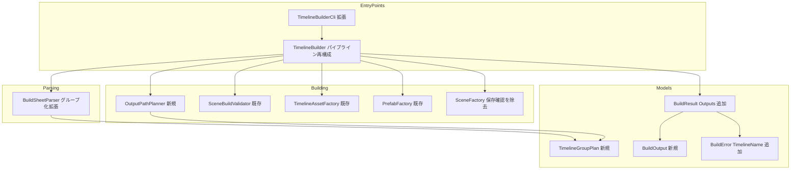
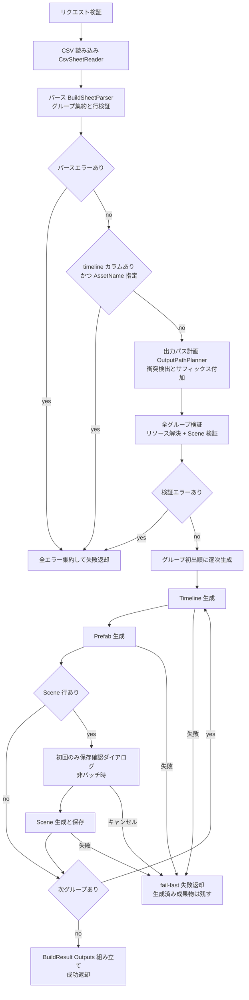
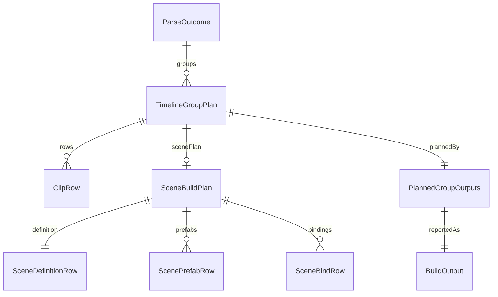

# Technical Design Document

## Overview

**Purpose**: 本機能は、UPM パッケージ「Unity Timeline Builder」を拡張し、1 つの構築情報 CSV/TSV に複数の Timeline を記述して 1 回の構築処理で複数の TimelineAsset / Prefab / Scene を同時生成する能力を、コンテンツ制作者・ビルドパイプライン管理者・ツール開発者へ提供する。

**Users**: コンテンツ制作者は 1 つの Google スプレッドシートで複数演出の Timeline と Scene を管理し、ビルドパイプライン管理者は CLI の 1 回実行で全成果物を生成する。ツール開発者は既存の公開 API から複数出力を判別可能な形式で取得する。

**Impact**: 既存の CSV → TimelineAsset / Prefab / Scene パイプライン（timeline-prefab-builder / timeline-scene-builder 仕様）への拡張。CSV フォーマットに任意の `timeline` カラム（D-1）を追加し、`TimelineBuilder.Build` の制御フローを「パース → 命名・パス計画 → 全グループ検証 → グループ逐次生成」へ再構成する。単一 Timeline 分の生成仕様（パース規約・リソース解決・各 Factory・バインディング規約）と public API / CLI の呼び出し互換は変更しない（5.4, 6.1–6.3）。

### Goals
- `timeline` カラムによる Timeline グループ化（ヘッダあり時のみ・列順自由・行順自由・初出順で出力順安定）を既存パース規約の上に定義する（1.1–1.6）
- 1 回の Build でグループごとに TimelineAsset → Prefab → Scene を生成し、fail-fast と出力パスの衝突自動回避（大文字小文字非区別 + 連番サフィックス + 警告）を提供する（2.x, 3.x, D-7, D-8)
- `BuildResult` を加法的に拡張し、Timeline ごとの成果物判別（`Outputs`）とレガシー呼び出し元の互換（既存プロパティ）を両立する（4.1, 5.1, 6.3）
- テンプレート・列定義ドキュメントを拡張後のパーサー仕様と同期させる（7.1–7.3）

### Non-Goals
- 複数構築情報ファイルの一括入力（入力は従来どおり 1 ファイル）
- Timeline グループ間の相互参照（暗黙参照は同一グループ内のみ。既存 TimelineAsset の `Assets/` 明示参照は既存仕様どおり）
- 単一 Timeline 分の構築仕様自体の変更（パース規約、リソース解決、TimelineAsset / Prefab / Scene 生成、バインディング規約）
- 既存 Scene への追記・マージ、AnimationTrack 以外のバインディング（既存仕様の Out of scope を踏襲）
- ビルド跨ぎの上書き検出（既存アセットへの上書きは従来どおり `Overwriting ...` ログ付きで実行。2.6）

## Boundary Commitments

### This Spec Owns
- `timeline` カラムの列仕様（認識条件・必須性・妥当性検証）と行のグループ帰属規則の定義・実装
- グループ単位へ再スコープした行検証（Scene 行 1 行制約、ScenePrefab / SceneBind 前提検証、SceneBind 重複検証）
- 出力パス計画（`OutputPathPlanner`）：命名確定タイミング、衝突判定（OrdinalIgnoreCase・同一ビルド内スコープ）、連番サフィックス規則、リネーム警告
- `TimelineBuilder.Build` の制御フロー（パース → 計画 → 全グループ検証 → グループ逐次生成、fail-fast、Scene 保存確認ダイアログの 1 回集約）
- `BuildResult.Outputs` / `BuildOutput` / `BuildError.TimelineName` / `BuildErrorCode.AssetNameConflict` の契約
- `multi-timeline-template.csv` の追加と `column-definitions.md` の `timeline` カラム仕様追記

### Out of Boundary
- 各グループ単体の生成挙動（`CsvSheetReader` / リソース解決 / `TimelineAssetFactory` / `PrefabFactory` / `TrackBindingApplier` / トラック集約規則の中身）— timeline-prefab-builder / timeline-scene-builder 仕様が所有し、無変更で再利用する
- `SceneFactory` の Scene 生成・配置・保存手順の中身（保存確認ダイアログの責務移動のみ本仕様が行う）
- 既存 `timeline-template.csv` の内容（不変。research.md の Decision 参照）
- Google スプレッドシート側の運用、Build Settings / Addressables 登録、Unity プロセス起動管理

### Allowed Dependencies
- `com.unity.timeline` 1.8.13 / Unity Editor API（`AssetDatabase`、`EditorSceneManager`、`PrefabUtility`）— 既存依存のまま、追加依存なし
- 既存レイヤー構造 `Models → Parsing → Resources → Building → Api → Cli` に従う。左のレイヤーは右を import しない。新規の `OutputPathPlanner` は Building 層、`TimelineGroupPlan` / `BuildOutput` は Models / Parsing 層に属する
- 外部 NuGet / サードパーティライブラリへの依存は禁止

### Revalidation Triggers
- `timeline` カラムの認識条件・必須性・グループ帰属規則の変更 → テンプレート・列定義ドキュメント・パーサーの三者同期を再検証（7.3）
- `BuildResult` / `BuildOutput` / `BuildErrorCode` の形状変更 → CLI 利用側（CI スクリプト）と API 利用者への影響確認
- サフィックス書式・衝突判定スコープの変更 → BuildResult 返却パスによる追跡可能性（D-8 の前提）の再確認
- 生成順序（グループごと Timeline → Prefab → Scene）の変更 → `NewScene(Single)` の参照破棄対策とレガシー挙動（キャンセル時の成果物状態）の再検証

## Architecture

### Existing Architecture Analysis
- **パイプライン + Strategy レジストリ**: `TimelineBuilder.Build` が Parse → Resolve（Phase A）→ 生成（Phase B）を統括。`BuildError` を収集し、Phase A にエラーがあれば Phase B に進まない
- **命名タイミングの制約**: 現行はパース**前**にアセット名・出力パスを確定している。D-2（Timeline 名 = アセット名）とは順序が逆であり、命名確定のパース後への移動が本設計の中心的変更となる
- **維持すべき統合点**: `CsvSheetReader.ReadAll`、`TimelineAssetFactory.Create` / `PrefabFactory.Create` / `SceneFactory.TryCreate`（保存確認除く）/ `SceneBuildValidator.TryValidate` / `TrackBindingApplier` の各契約、`BuildResult` の public コンストラクタ 2 種、CLI 引数・exit code 体系（0/1/2）、`[UnityTimelineBuilder]` ログ接頭辞と `Overwriting ...` ログ、`(trackType, trackName)` によるトラック集約
- **internal 境界**: `ParseOutcome` / `SceneBuildPlan` / Factory 群は internal のため、グループ化に伴う形状変更は公開互換に影響しない（テストは `InternalsVisibleTo` 経由で更新する）
- steering 未整備のため、timeline-scene-builder 設計のレイヤー規約・パターンを基準として踏襲する

### Architecture Pattern & Boundary Map

採用パターン: **ハイブリッド拡張**（パーサーのグループ化対応 + パイプライン再構成 + 純ロジック Planner 新設。Factory / Resolver / Reader は無変更で再利用）。代替案の評価は `research.md` 参照。



**Architecture Integration**:
- Domain boundaries: Parsing は「行 → グループ化済み計画（`TimelineGroupPlan`）」まで、`OutputPathPlanner` は「グループ列 → 衝突解決済み出力パス計画」のみ、Api 層は「フェーズ統括・fail-fast・ダイアログ集約・結果組み立て」のみを所有する
- Existing patterns preserved: `BuildError` 収集、`TryXxx + out` パターン、上書きログ、冪等上書き、レイヤー依存方向
- New components rationale: 命名・衝突解決は Unity API 非依存の純ロジックであり、`OutputPathPlanner` として分離することで EditMode 単体テストで全衝突パターンを検証可能にする
- Steering compliance: steering 未整備のため timeline-scene-builder 設計の規約を基準とする

### Technology Stack

| Layer | Choice / Version | Role in Feature | Notes |
|-------|------------------|-----------------|-------|
| パース / 計画 | .NET Standard 2.1 相当の C#（Unity 6000.0） | グループ集約・妥当性検証・衝突解決の純ロジック | 新規依存なし |
| アセット生成 | UnityEditor.AssetDatabase / PrefabUtility / EditorSceneManager | 既存 Factory 経由の生成をグループ数だけ反復 | 使用 API は既存のまま |
| Timeline | com.unity.timeline 1.8.13 | TimelineAsset 生成・AnimationTrack 照合 | 既存依存のまま |
| テスト | com.unity.test-framework（EditMode） | Planner 単体・複数グループ統合・新テンプレート E2E | 既存導入済み |

## File Structure Plan

### Directory Structure（新規ファイル）
```
UnityTimelineBuilder/Packages/com.hidano.unity-timeline-builder/
├── Editor/
│   ├── Models/
│   │   ├── TimelineGroupPlan.cs      # グループ化済み構築計画（internal）
│   │   └── BuildOutput.cs            # グループ別成果物パス（public）
│   └── Building/
│       └── OutputPathPlanner.cs      # 命名・衝突解決の純ロジック（internal）
├── Documentation~/
│   └── multi-timeline-template.csv   # 複数 Timeline 記入例テンプレート
└── Tests/Editor/
    ├── OutputPathPlannerTests.cs         # 衝突・サフィックスの単体テスト
    └── MultiTimelineTemplateE2ETests.cs  # 新テンプレートの E2E
```

### Modified Files
- `Editor/Parsing/BuildSheetParser.cs` — `timeline` カラム認識（ヘッダあり時のみ）、行のグループ帰属、timeline セル必須検証・名前妥当性検証、Scene 行検証のグループ単位化。`ParseOutcome` をグループ列ベースへ再構成
- `Editor/Api/TimelineBuilder.cs` — パイプライン再構成（パース → AssetName 競合検査 → パス計画 → 全グループ検証 → グループ逐次生成）、Scene 保存確認の 1 回集約、`BuildResult` 組み立て
- `Editor/Models/BuildResult.cs` — `Outputs` 追加（加法的）。既存コンストラクタ維持
- `Editor/Models/BuildError.cs` — `TimelineName` プロパティ追加（加法的）、`BuildErrorCode.AssetNameConflict` を末尾追加
- `Editor/Building/SceneFactory.cs` — `SaveCurrentModifiedScenesIfUserWantsTo` の呼び出しを除去（Api 層へ移動）
- `Editor/Api/TimelineBuilderCli.cs` — 成功時の全成果物ログ出力（`Outputs` 走査）、エラーログへの Timeline 名付与
- `Documentation~/column-definitions.md` — `timeline` カラム仕様・帰属規則・グループ単位制約・衝突リネーム規則の追記（7.2, 7.3）
- `Tests/Editor/BuildSheetParserTests.cs` ほか既存テスト — `ParseOutcome` 再構成への追従

**依存方向**: `Models → Parsing → Resources → Building → Api → Cli` を維持。`OutputPathPlanner` は Models（`TimelineGroupPlan`）のみに依存し、Unity API を import しない。

## System Flows

### 再構成後の Build パイプライン



**フローレベルの決定**:
- **検証の完全集約（4.2）**: パースエラー・AssetName 競合・リソース解決エラー・Scene 検証エラーは各ステージ内で全グループ分を集約してから返却する。リソース解決にエラーがあっても Scene 検証を全グループ実行してから合算する（現行の早期 return を廃止。レガシー入力でも成否・エラー形式は不変で、報告が増える方向のみの変更）
- **fail-fast の粒度（D-7, 4.3）**: 生成フェーズはグループ単位。失敗時点で中断し、生成済み成果物はディスクへ残す。失敗エラーには対象 Timeline 名を付与し、`Outputs` には生成に到達した成果物のみが載るため「どこまで成功したか」を判別できる
- **保存確認ダイアログの集約**: 非バッチ時、ビルド内で最初に Scene 生成へ到達した時点で 1 回のみ実行。キャンセルは `SceneBuildCanceled` で fail-fast（レガシー入力のタイミング・成果物状態は現行と同一）

## Requirements Traceability

| Requirement | Summary | Components | Interfaces | Flows |
|-------------|---------|------------|------------|-------|
| 1.1 | `timeline` カラムの定義 | BuildSheetParser | ParseOutcome.Groups | パース |
| 1.2 | 行のグループ帰属（行順自由） | BuildSheetParser | TimelineGroupPlan | パース |
| 1.3 | 同名行の同一グループ集約 | BuildSheetParser | TimelineGroupPlan（Ordinal キー） | パース |
| 1.4 | 既存パース規約でのパース | CsvSheetReader（無変更）/ BuildSheetParser | 既存 ReadAll | パース |
| 1.5 | 空欄・不正名の行番号付きエラー | BuildSheetParser | RowValidationError | パース |
| 1.6 | ヘッダー行がある場合のみ認識 | BuildSheetParser | ヘッダー判定（既存）+ timeline 列検出 | パース |
| 2.1 | グループごとの TimelineAsset 生成 | TimelineBuilder / TimelineAssetFactory（無変更） | 生成ループ | 生成 |
| 2.2 | グループごとの Prefab 生成 | TimelineBuilder / PrefabFactory（無変更） | 生成ループ | 生成 |
| 2.3 | Timeline 名 = アセット名 | OutputPathPlanner | PlannedGroupOutputs.AssetName | 計画 |
| 2.4 | トラック集約のグループ内限定 | TimelineBuilder（グループ別に Factory 呼び出し） | TimelineAssetFactory.Create（グループの行のみ渡す） | 生成 |
| 2.5 | アセットパス衝突の連番回避 + 警告 | OutputPathPlanner | PlannedGroupOutputs.Warnings | 計画 |
| 2.6 | 既存アセットの上書き + ログ | 各 Factory（無変更） | Overwriting ログ | 生成 |
| 3.1 | Scene 行はグループごとに高々 1 行 | BuildSheetParser | グループ単位検証 | パース |
| 3.2 | グループの Scene 生成（既存仕様どおり） | SceneFactory（保存確認除き無変更） | SceneBuildContext | 生成 |
| 3.3 | 暗黙参照を同一グループの TimelineAsset へ解決 | TimelineBuilder / OutputPathPlanner | SceneBuildContext（計画済みパスで構築） | 生成 |
| 3.4 | ScenePrefab / SceneBind のグループ適用 | BuildSheetParser / SceneBuildValidator（グループ別呼び出し） | SceneBuildPlan（グループ内） | パース / 検証 |
| 3.5 | グループ内 Scene 行 2 行以上でエラー | BuildSheetParser | RowValidationError | パース |
| 3.6 | Scene 行なしグループの ScenePrefab / SceneBind エラー | BuildSheetParser | RowValidationError | パース |
| 3.7 | Scene 出力衝突の連番回避 + 警告 | OutputPathPlanner | PlannedGroupOutputs.ScenePath / Warnings | 計画 |
| 4.1 | Timeline 別の成果物パス返却 | BuildResult / BuildOutput | BuildResult.Outputs | 結果組み立て |
| 4.2 | 検証エラーの全件集約後に中断 | TimelineBuilder | エラー集約ステージ | 検証 |
| 4.3 | 生成中エラーの fail-fast と到達点報告 | TimelineBuilder | BuildError.TimelineName + Outputs | 生成 |
| 4.4 | エラーへの行番号・対象 Timeline 付与 | BuildError | TimelineName プロパティ | 全域 |
| 5.1 | API の複数出力返却 | BuildResult | Outputs | 結果組み立て |
| 5.2 | CLI 成功時の全成果物ログ + exit 0 | TimelineBuilderCli | Run（Outputs 走査） | CLI |
| 5.3 | CLI 失敗時の原因ログ + 非 0 exit | TimelineBuilderCli | FormatError（Timeline 名付与） | CLI |
| 5.4 | API / CLI の呼び出し互換維持 | TimelineBuilder / TimelineBuilderCli | 既存シグネチャ・引数不変 | — |
| 5.5 | AssetName 競合エラー | TimelineBuilder | BuildErrorCode.AssetNameConflict | 競合検査 |
| 6.1 | レガシー入力の同一挙動 | 全コンポーネント | 単一グループ経路 | 全域 |
| 6.2 | 既存パース規約の維持 | CsvSheetReader / BuildSheetParser | ヘッダー判定・7 列フォールバック不変 | パース |
| 6.3 | レガシー結果形式の維持 | BuildResult | 既存プロパティ = 先頭グループ写像 | 結果組み立て |
| 7.1 | テンプレートへの記入例追加 | multi-timeline-template.csv | — | — |
| 7.2 | 列定義ドキュメントの追記 | column-definitions.md | — | — |
| 7.3 | ドキュメントとパーサー仕様の一致 | column-definitions.md / テンプレート / E2E テスト | MultiTimelineTemplateE2ETests | — |

## Components and Interfaces

| Component | Domain/Layer | Intent | Req Coverage | Key Dependencies (P0/P1) | Contracts |
|-----------|--------------|--------|--------------|--------------------------|-----------|
| BuildSheetParser（拡張） | Parsing | timeline カラム認識とグループ化済み計画の生成 | 1.1–1.6, 3.1, 3.4–3.6, 6.2 | CsvSheetReader の出力（P0） | Service |
| TimelineGroupPlan / ParseOutcome（再構成） | Models / Parsing | グループ化済み構築計画の不変モデル | 1.2, 1.3 | — | State |
| OutputPathPlanner（新規） | Building | 命名確定・衝突検出・サフィックス付加 | 2.3, 2.5, 3.7 | TimelineGroupPlan（P0） | Service |
| TimelineBuilder（再構成） | Api | フェーズ統括・fail-fast・ダイアログ集約・結果組み立て | 2.1, 2.2, 2.4, 3.2, 3.3, 4.2, 4.3, 5.4, 5.5, 6.1 | Parser / Planner / Validator / Factory 群（P0） | Service |
| BuildResult / BuildOutput / BuildError（拡張） | Models | 複数出力の判別可能な返却とレガシー互換 | 4.1, 4.4, 5.1, 6.3 | — | State |
| TimelineBuilderCli（拡張） | Cli | 複数成果物ログと exit code | 5.2, 5.3, 5.4 | TimelineBuilder（P0） | Service |
| SceneFactory（縮小） | Building | 保存確認ダイアログ責務の除去 | 3.2 | EditorSceneManager（P0） | Service |
| テンプレート / ドキュメント | Documentation~ | 記入例と列仕様の同期 | 7.1–7.3 | — | — |

### Parsing

#### BuildSheetParser（拡張）

| Field | Detail |
|-------|--------|
| Intent | 既存パース規約の上に `timeline` カラム認識・行のグループ帰属・グループ単位検証を追加する |
| Requirements | 1.1, 1.2, 1.3, 1.4, 1.5, 1.6, 3.1, 3.4, 3.5, 3.6, 6.2 |

**Responsibilities & Constraints**
- `timeline` カラムは**ヘッダー行がある場合のみ**認識する（列名照合は既存ヘッダーと同じ OrdinalIgnoreCase、列順自由）。ヘッダーレスシートは従来の既定 7 列順・単一グループとして解釈し、`timeline` カラム概念を持たない（1.6, 6.2）
- `timeline` カラムが存在する場合、**全データ行**（クリップ行および Scene / ScenePrefab / SceneBind 行）で timeline セルの値を必須とする。空欄は行番号付き `RowValidationError`（1.5, D-4）
- Timeline 名の妥当性検証は Scene 名と同一規則（制御文字・`<>:"/\|?*`・末尾ピリオド/空白・`.`/`..` を拒否）。既存 `IsValidSceneName` を共通ヘルパー `IsValidAssetFileName` へ抽出し両者で使用する。違反は行番号 + 名前を含む `RowValidationError`（1.5）
- グループ集約キーはトリム後の Timeline 名の **Ordinal 完全一致**（大文字小文字違いは別グループ。research.md の Decision 参照）。グループの順序はシート内**初出順**（1.2, 1.3, D-3）
- `timeline` カラムが無い場合は全行を単一グループ（`TimelineName = null`）へ集約する（6.1）
- Scene 行検証をグループ単位へ再スコープする: Scene 行はグループごとに高々 1 行（超過は行番号付きエラー）、Scene 行を持たないグループの ScenePrefab / SceneBind はエラー、SceneBind の Track 名重複検証もグループ内スコープ（3.1, 3.4, 3.5, 3.6）
- 行検証（必須列・数値・範囲・trackType 判定）は既存実装を無変更で再利用する（1.4, 6.2）

**Dependencies**
- Inbound: TimelineBuilder — パース呼び出し（P0）
- Outbound: TimelineGroupPlan / SceneBuildPlan / ClipRow — 出力モデル（P0）

**Contracts**: Service [x] / State [ ]

##### Service Interface
```csharp
internal sealed class BuildSheetParser
{
    // シグネチャは現行を維持。戻り値の ParseOutcome を再構成する。
    public ParseOutcome Parse(IReadOnlyList<IReadOnlyList<string>> rawRows);
}

internal sealed class ParseOutcome
{
    /// <summary>シート内初出順のグループ列。レガシー入力では TimelineName = null の単一要素。</summary>
    public IReadOnlyList<TimelineGroupPlan> Groups { get; }
    /// <summary>timeline カラムを認識したか（AssetName 競合検査に使用）。</summary>
    public bool HasTimelineColumn { get; }
    public IReadOnlyList<BuildError> Errors { get; }
    public string WarningMessage { get; }
}
```
- Preconditions: `rawRows` は `CsvSheetReader.ReadAll` の出力（RFC 4180 準拠パース済み）
- Postconditions: `Errors` が空のとき、全行がいずれかのグループへ一意に帰属し、各グループの Scene 行制約・SceneBind 重複制約を満たす。`Groups` の順序は初出順
- Invariants: 同一 Timeline 名（Ordinal）の行は必ず同一グループに属する。ヘッダーレス時は `HasTimelineColumn == false`

**Implementation Notes**
- Integration: `ParseOutcome.Rows` / `ScenePlan`（旧形状）は `Groups` に置換される。internal のため公開互換に影響なし。`BuildSheetParserTests` をグループ前提へ更新
- Validation: エラー集約（行番号付き）で全行の検証を完了してから返す（既存パターン踏襲、4.2 に寄与）
- Risks: `timeline` という名前の列を既に無視されるダミー列として持つ既存ヘッダありシートは挙動が変わる（全行必須化）。列定義ドキュメントに予約列名として明記して緩和

### Models

#### TimelineGroupPlan（新規・internal）

| Field | Detail |
|-------|--------|
| Intent | 1 グループ分の構築計画（行・Scene 計画・初出位置）を保持する不変モデル |
| Requirements | 1.2, 1.3, 2.4 |

**Contracts**: State [x]

##### State Management
```csharp
internal sealed class TimelineGroupPlan
{
    /// <summary>CSV 記載の Timeline 名。レガシー単一グループでは null。</summary>
    public string TimelineName { get; }
    /// <summary>グループ初出行の行番号（出力順・エラー文脈用）。</summary>
    public int FirstLineNumber { get; }
    /// <summary>このグループに帰属するクリップ行（シート内出現順）。</summary>
    public IReadOnlyList<ClipRow> Rows { get; }
    /// <summary>このグループの Scene 構築計画。Scene 行が無ければ null。</summary>
    public SceneBuildPlan ScenePlan { get; }
}
```
- State model: 不変（コンストラクタでコピー、既存 `SceneBuildPlan` と同パターン）
- Persistence & consistency: 永続化なし。`ClipRow` / `SceneBuildPlan` は既存型を無変更で内包

#### BuildResult / BuildOutput / BuildError（加法的拡張・public）

| Field | Detail |
|-------|--------|
| Intent | 複数 Timeline 分の成果物パスを判別可能に返却しつつ、レガシー呼び出し元の互換を維持する |
| Requirements | 4.1, 4.3, 4.4, 5.1, 6.3 |

**Responsibilities & Constraints**
- **レガシー写像規則（6.3）**: `TimelineAssetPath` / `PrefabPath` / `ScenePath` は `Outputs` の**先頭要素**（初出順の第 1 グループ）の値。`Outputs` が空のときは null。レガシー入力ではグループが常に 1 つのため、値・失敗時の部分設定（Timeline / Prefab 生成済みで Scene 失敗など）を含め現行と完全一致する
- **fail-fast 時の内容（4.3）**: `Outputs` には生成が完了した成果物パスのみを設定する（未生成は null、未着手グループはエントリなし）。失敗原因の `BuildError` に `TimelineName` を設定し、どのグループで失敗しどこまで成功したかを判別可能にする
- 既存 public コンストラクタ 2 種は維持し、引数から単一 `BuildOutput` を合成する（パスが全て null の場合は `Outputs` を空にする）
- `BuildErrorCode` は末尾へ `AssetNameConflict` を追加（enum の加法的拡張。既存値の序数は不変）

**Contracts**: State [x]

##### State Management
```csharp
public sealed class BuildOutput
{
    /// <summary>CSV 記載の Timeline 名。レガシー入力では確定アセット名と同値。</summary>
    public string TimelineName { get; }
    /// <summary>サフィックス適用後の最終アセット名（Prefab ルート名・Director 名にも使用）。</summary>
    public string ResolvedAssetName { get; }
    public string TimelineAssetPath { get; }  // 未生成時 null
    public string PrefabPath { get; }         // 未生成時 null
    public string ScenePath { get; }          // Scene 行なし・未生成時 null
}

public sealed class BuildResult
{
    public bool Success { get; }
    public string TimelineAssetPath { get; }  // 既存: Outputs 先頭の写像
    public string PrefabPath { get; }         // 既存: 同上
    public string ScenePath { get; }          // 既存: 同上
    /// <summary>グループ初出順の成果物一覧（新規・加法的）。</summary>
    public IReadOnlyList<BuildOutput> Outputs { get; }
    public IReadOnlyList<BuildError> Errors { get; }

    // 既存コンストラクタ 2 種は維持（単一 BuildOutput を合成）
    public BuildResult(bool success, string timelineAssetPath, string prefabPath,
        IReadOnlyList<BuildError> errors);
    public BuildResult(bool success, string timelineAssetPath, string prefabPath,
        string scenePath, IReadOnlyList<BuildError> errors);
    // 新規: 複数出力用
    public BuildResult(bool success, IReadOnlyList<BuildOutput> outputs,
        IReadOnlyList<BuildError> errors);
}

public sealed class BuildError
{
    public BuildErrorCode Code { get; }
    public int? LineNumber { get; }
    public string SourcePath { get; }
    public string Message { get; }
    /// <summary>対象 Timeline 名（新規・加法的）。特定不能な全体エラーでは null。</summary>
    public string TimelineName { get; }

    public BuildError(BuildErrorCode code, int? lineNumber, string sourcePath, string message);          // 既存（TimelineName = null）
    public BuildError(BuildErrorCode code, int? lineNumber, string sourcePath, string message,
        string timelineName);                                                                            // 新規
}
```

### Building

#### OutputPathPlanner（新規・internal）

| Field | Detail |
|-------|--------|
| Intent | パース後のグループ列から全出力パスを確定し、ビルド内衝突を検出して連番サフィックスで解決する純ロジック |
| Requirements | 2.3, 2.5, 3.7 |

**Responsibilities & Constraints**
- **命名規則（2.3, D-2）**: グループのアセット名 = `TimelineName`（トリム済み）。レガシー単一グループ（`TimelineName == null`）は従来規則（`request.AssetName` またはシートファイル名）を `fallbackAssetName` として使用する
- **衝突判定スコープ**: **同一ビルド内の計画出力パス間のみ**（OrdinalIgnoreCase の完全パス比較）。ディスク上の既存アセットは判定対象外（Req 2.6 の上書き仕様に委ねる）。research.md の Decision 参照
- **衝突単位**: (a) グループのアセット名単位（`.playable` と `.prefab` のペア。常に同名を維持）、(b) Scene 名単位（`.unity`）。拡張子が固定のため同一グループ内の衝突は構造上発生しない（既存 `SceneBuildValidator.ValidateSceneOutputPath` の防御的チェックはグループ単位でそのまま維持）
- **解決規則（D-8）**: グループ初出順に処理し、先出が名前を保持、後出の衝突単位に ` (1)` から始まる連番サフィックスを付加して衝突が消えるまで増分する。リネームごとに「元の名前 → 最終パス」を特定できる警告メッセージを生成する（呼び出し元が `Debug.LogWarning` で出力）
- Unity API に依存しない純ロジックとし、EditMode 単体テストで全衝突パターンを検証可能にする

**Dependencies**
- Inbound: TimelineBuilder — 計画呼び出し（P0）
- Outbound: TimelineGroupPlan — 入力モデル（P0）

**Contracts**: Service [x]

##### Service Interface
```csharp
internal sealed class PlannedGroupOutputs
{
    public TimelineGroupPlan Group { get; }
    /// <summary>サフィックス適用後の最終アセット名。Prefab ルート名・Director 名にも使用する。</summary>
    public string AssetName { get; }
    public string TimelineAssetPath { get; }
    public string PrefabPath { get; }
    /// <summary>サフィックス適用後の Scene 出力パス。Scene 行なしのグループでは null。</summary>
    public string ScenePath { get; }
    /// <summary>リネーム発生時の警告メッセージ（0 件以上）。</summary>
    public IReadOnlyList<string> Warnings { get; }
}

internal sealed class OutputPathPlanner
{
    /// <summary>グループ初出順に出力パスを計画し、ビルド内衝突をサフィックスで解決する。</summary>
    public IReadOnlyList<PlannedGroupOutputs> Plan(
        IReadOnlyList<TimelineGroupPlan> groups,
        string outputDirectory,
        string fallbackAssetName);
}
```
- Preconditions: `groups` は初出順・Timeline 名検証済み（パーサーが保証）。`outputDirectory` は `Assets/` 配下検証済み
- Postconditions: 返却される全パス（Timeline / Prefab / Scene）は OrdinalIgnoreCase で互いに一意。`.playable` と `.prefab` は常に同じ基底名。入力順序を保持
- Invariants: サフィックス書式は `{基底名} (n)`（n は 1 起点の整数）。先出グループの名前は変更されない

**Implementation Notes**
- Integration: 計画結果はそのまま検証（`SceneBuildValidator` へグループの計画パスを渡す）と生成（`SceneBuildContext` 構築）に使用する。これにより **Req 3.3（暗黙参照）はリネーム後も構造的に一致が保証される**（Scene の Director へ渡す Timeline パスは常に同一グループの計画済みパス）
- Validation: 単体テストで「大文字小文字違いの Timeline 名」「Scene 名同士の衝突」「サフィックス自体の再衝突（`A` と `A (1)` が両方 CSV に存在）」を網羅
- Risks: サフィックス付き出力は CSV 記載と名前が一致しない（D-8 既知リスク）。警告ログと `BuildOutput.TimelineName` / `ResolvedAssetName` の対で追跡可能にする

### Api

#### TimelineBuilder（パイプライン再構成）

| Field | Detail |
|-------|--------|
| Intent | 「パース → 競合検査 → パス計画 → 全グループ検証 → グループ逐次生成」のフェーズ統括と結果組み立て |
| Requirements | 2.1, 2.2, 2.4, 2.6, 3.2, 3.3, 4.1, 4.2, 4.3, 5.4, 5.5, 6.1 |

**Responsibilities & Constraints**
- 公開シグネチャ `Build(BuildRequest)` / `Build(string, string, string)` は不変（5.4）。`BuildRequest` も不変
- **AssetName 競合検査（5.5, D-5)**: パース後、`ParseOutcome.HasTimelineColumn && !string.IsNullOrWhiteSpace(request.AssetName)` のとき `BuildErrorCode.AssetNameConflict` で中断（生成前）
- **検証ステージ（4.2)**: リソース解決（全グループの全行）と Scene 検証（Scene 計画を持つ全グループに対し `SceneBuildValidator.TryValidate` をグループの行・計画パスで呼び出し）を**全て実行してから**エラーを合算し、1 件以上あれば生成せず失敗返却。エラーには帰属グループの `TimelineName` を設定する
- **生成ステージ（2.1, 2.2, 2.4, 3.2, D-7)**: グループ初出順に Timeline → Prefab → Scene を逐次実行。各 Factory へは**そのグループの行・計画パスのみ**を渡す（トラック集約のグループ内限定は既存 `TimelineAssetFactory` にグループの行だけを渡すことで実現する）。失敗時は fail-fast し、`BuildError.TimelineName` と生成済み `Outputs` で到達点を報告（4.3）
- **Scene 保存確認の集約**: 非バッチ時、最初の Scene 生成の直前に `EditorSceneManager.SaveCurrentModifiedScenesIfUserWantsTo()` を 1 回だけ実行。キャンセルは `SceneBuildCanceled` で fail-fast（レガシー入力の挙動・成果物状態は現行と同一）
- 計画フェーズの警告（リネーム）は生成前に `Debug.LogWarning("[UnityTimelineBuilder] ...")` で出力する（2.5, 3.7）
- Prefab ルート名・Scene の Director オブジェクト名には `PlannedGroupOutputs.AssetName`（サフィックス適用後）を使用し、ファイル名と GameObject 名の一致を保つ

**Dependencies**
- Inbound: TimelineBuilderCli / 外部ツールコード — 公開 API（P0）
- Outbound: BuildSheetParser / OutputPathPlanner / SceneBuildValidator / TimelineAssetFactory / PrefabFactory / SceneFactory — 各フェーズ実行（P0）
- External: AssetDatabase / EditorSceneManager — 保存・Import・ダイアログ（P0）

**Contracts**: Service [x]（公開シグネチャ不変のため定義は省略。System Flows 参照）

**Implementation Notes**
- Integration: `AssetDatabase.SaveAssets` + 同期 Import はグループごとに実行（Scene の暗黙参照が永続化済みアセットを要求するため）。出力ログは成果物ごとに既存書式（`TimelineAsset: ...` / `Prefab: ...` / `Scene: ...`）を維持
- Validation: レガシー入力（ヘッダーレス / timeline カラムなし）の統合テストで命名・出力先・ログ・結果の同一性を確認（6.1）
- Risks: `NewScene(Single)` の参照破棄がグループ間へ波及し得る — グループ単位生成 + 既存のパス再ロード防御で緩和し、複数 Scene 生成の統合テストで検証

### Cli

#### TimelineBuilderCli（拡張）

| Field | Detail |
|-------|--------|
| Intent | 複数成果物のログ出力と Timeline 名付きエラー報告。引数仕様・exit code 体系は不変 |
| Requirements | 5.2, 5.3, 5.4, 5.5 |

**Responsibilities & Constraints**
- 成功時は `result.Outputs` を走査し、成果物ごとに既存書式でログ出力（レガシー入力では現行と同一の 2〜3 行になる）（5.2）
- 失敗時の `FormatError` に `TimelineName` を追記する（例: `RowValidationError (行 5) [Title]: ...`）。`TimelineName` が null の場合は現行書式のまま（5.3, 6.3）
- 引数（`-sheetPath` / `-outputDir` / `-assetName` / `-importDir`）と exit code（0/1/2）は不変。`-assetName` と timeline カラムの競合は API 層の `AssetNameConflict` エラーとして exit code 1 で報告される（5.4, 5.5）

**Contracts**: Service [x]（公開シグネチャ不変のため定義は省略）

### Building（変更）

#### SceneFactory（保存確認の除去）

- `TryCreate` 冒頭の `SaveCurrentModifiedScenesIfUserWantsTo` ブロックを削除し、ダイアログ責務を Api 層へ移す。その他の契約（`SceneBuildContext` 入力、生成・配置・バインド・保存、`TryXxx + out` パターン）は不変
- internal のため公開互換に影響なし。`SceneFactoryTests` の該当ケースを Api 層のテストへ移設する

### Documentation~

#### multi-timeline-template.csv（新規）/ column-definitions.md（更新）

- 新テンプレートは `timeline` カラム付きヘッダーで 2 グループ以上（各グループにクリップ行 + 片方に Scene / ScenePrefab / SceneBind 行）を記載し、インターリーブの例を含める（7.1）
- `column-definitions.md` へ追記する内容（7.2, 7.3）: `timeline` カラムの名称・意味・データ型（string、ファイル名として有効）・必須/任意（列自体は任意。列が存在する場合は全行必須）・ヘッダー行必須の認識条件・記入例、行の帰属規則（行順自由・初出順出力・Ordinal 同一性）、グループ単位へ緩和された Scene 行制約、アセット名規則（Timeline 名 = アセット名、AssetName 指定との競合エラー）、衝突時の ` (n)` リネームと警告
- 既存 `timeline-template.csv` は不変（research.md の Decision 参照）

## Data Models

### Domain Model

集約ルートは **TimelineGroupPlan**（グループ = トランザクション境界。生成はグループ単位で完結し、fail-fast の粒度もグループ）。



**Business rules & invariants**:
- Timeline 名（Ordinal・トリム後）はグループの自然キー。`null` はレガシー単一グループのみに許され、複数グループと共存しない（timeline カラムの有無で排他）
- グループ順序は初出行番号順で全域（計画・検証・生成・`Outputs`・エラー報告）にわたり一貫する
- `PlannedGroupOutputs` 確定後、後続フェーズは CSV 記載名ではなく計画済みパス・`AssetName` のみを参照する（リネームの一貫伝搬）
- 既存型 `ClipRow` / `SceneBuildPlan` / `SceneDefinitionRow` / `ScenePrefabRow` / `SceneBindRow` は無変更

### Data Contracts & Integration
- **API**: `BuildResult.Outputs`（public）が唯一の新規データ契約。スキーマは Components 節の定義どおり。後方互換はレガシー写像規則（先頭グループ）で担保
- **CLI ログ**: 成果物ログ書式（`[UnityTimelineBuilder] TimelineAsset: {path}` 等）は行数のみ増加し書式不変。CI のログパースへの影響は加法的

## Error Handling

### Error Strategy
既存の `BuildError` 集約 + fail-fast パターンを踏襲し、検証フェーズは全件集約・生成フェーズは即時中断とする（4.2, 4.3, D-7）。リネーム（D-8）はエラーではなく警告ログ + 返却パスで扱う。

### Error Categories and Responses
- **入力エラー（検証フェーズ・全件集約後に中断、アセット未生成）**:
  - timeline セル空欄 / 名前不正 → `RowValidationError`（行番号 + 名前を明示）（1.5）
  - グループ内 Scene 行 2 行以上 / Scene 行なしグループの ScenePrefab・SceneBind → `RowValidationError`（行番号 + Timeline 名）（3.5, 3.6）
  - timeline カラム + AssetName 指定 → `AssetNameConflict`（新設コード。「timeline カラム使用時は AssetName を指定できない」旨と指定値を明示）（5.5）
  - リソース解決・Scene 検証エラー → 既存コードのまま `TimelineName` を付与（4.4）
- **生成エラー（fail-fast、生成済み成果物は残置）**: 既存コード（`OutputWriteFailed` / `SceneWriteFailed` / `SceneBuildCanceled` 等)に `TimelineName` を付与。`Outputs` の生成済みエントリで到達点を判別（4.3）
- **警告（処理継続）**: パス衝突リネーム（`元名 → 最終パス` を含む警告ログ）（2.5, 3.7）、ヘッダー未検出（既存）、上書き（既存 `Overwriting ...`）

### Monitoring
既存の `[UnityTimelineBuilder]` 接頭辞ログを維持。CLI は失敗時にエラー件数 + 全 `BuildError`（Timeline 名付き）を出力し exit code 1、引数不正は exit code 2（既存体系、5.3）。

## Testing Strategy

### Unit Tests
1. **BuildSheetParserTests（拡張)**: timeline カラム認識（列順自由 / ヘッダーレス無視 / 大文字小文字列名）、インターリーブ行の初出順グループ化、空欄・不正名エラーの行番号、グループ単位 Scene 行制約（2 行超過 / 前提欠落 / SceneBind 重複のグループ内スコープ）、レガシー入力の単一グループ化
2. **OutputPathPlannerTests（新規)**: 大文字小仮名違いアセット名の衝突 → ` (1)` 付加と警告、Scene 名衝突、サフィックス再衝突（`A` と `A (1)` 併存）、ペア（.playable/.prefab）の同名維持、レガシー fallback 命名、初出順の名前保持
3. **BuildModelTests（拡張)**: `BuildResult` レガシーコンストラクタの `Outputs` 合成、先頭グループ写像、`BuildError.TimelineName` の既定 null

### Integration Tests
1. **複数グループビルド**: 2 グループ + 各 Scene 行 → 全 6 成果物の生成・`Outputs` の初出順・Scene の暗黙参照が各グループの TimelineAsset を指すこと（NewScene(Single) 跨ぎの安全性を含む）
2. **リネーム伝搬**: 大文字小文字違いの 2 グループ → 後出のリネーム + Scene 暗黙参照がリネーム後パスを指すこと + 警告ログ
3. **fail-fast**: 第 2 グループの生成失敗 → 第 1 グループ成果物残置・`Outputs` / `TimelineName` による到達点報告・アセット未生成の検証エラー全件集約（4.2 / 4.3 の両モード）
4. **後方互換**: ヘッダーレス / timeline カラムなしシート → 現行と同一の命名・出力・結果形式（6.1–6.3)。AssetName 競合エラー（timeline カラム + `-assetName`）
5. **CLI（TimelineBuilderCliTests 拡張)**: 複数成果物ログと exit code、Timeline 名付きエラー書式

### E2E Tests
1. **MultiTimelineTemplateE2ETests（新規)**: 同梱 `multi-timeline-template.csv` を無改変入力とし、記載どおりの成果物が生成されること（7.1, 7.3）
2. **BundledTemplateE2ETests（既存・無変更で成功維持)**: 既存テンプレートの挙動不変の回帰確認（6.1）
