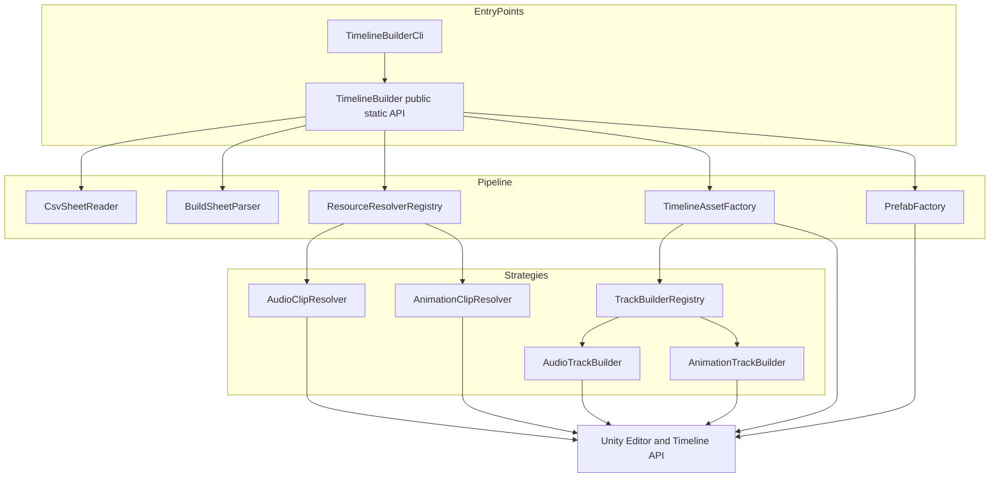
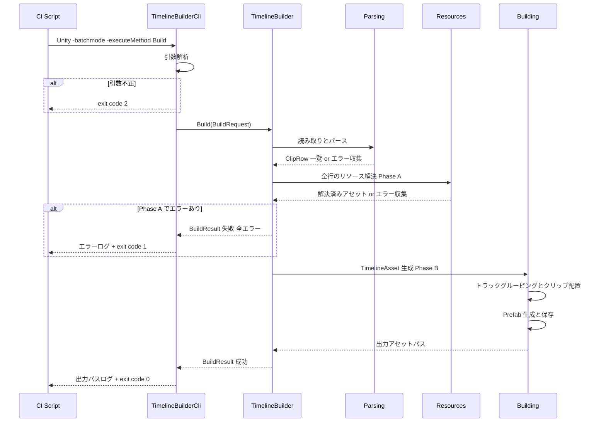

# Technical Design Document

## Overview

**Purpose**: 本機能は、CSV/TSV 形式の構築情報とリソースパスから TimelineAsset と PlayableDirector 付き Prefab を自動生成する UPM パッケージ「Unity Timeline Builder」をコンテンツ制作者・ビルドパイプライン管理者へ提供する。

**Users**: コンテンツ制作者は Google スプレッドシートで管理した演出データからワンコマンドで Timeline を構築し、ビルドパイプライン管理者は Unity Editor のバッチモード(-batchmode / -executeMethod)経由で CI からこれを自動実行する。ツール開発者は public static API を通じてエディタ拡張等から同一処理を再利用する。

**Impact**: グリーンフィールド開発。Unity プロジェクト UnityTimelineBuilder(Unity 6000.0.36f1)の `Packages/com.hidano.unity-timeline-builder/` に embedded package を新規作成する。既存コードへの変更はない。

### Goals
- Google スプレッドシートエクスポートの CSV/TSV をそのままパースし、AudioTrack / AnimationTrack とクリップ配置済みの TimelineAsset を生成する
- プロジェクト内既存アセット参照とプロジェクト外リソースのコピー・インポートを透過的に扱う
- public static API と CLI エントリポイント(exit code 0/1/2 とログによる結果判別)の両方を提供する
- トラック種別・リソース種別を、既存処理を変更せずに追加できる拡張構造(Strategy + Registry)にする
- CSV テンプレートと列定義ドキュメントをパッケージに同梱する

### Non-Goals
- JSON/XML など CSV/TSV 以外の構築情報フォーマット(将来拡張)
- AudioTrack / AnimationTrack 以外のトラック種別の実装(拡張ポイントのみ用意)
- トラックバインディング(Animator / AudioSource 等)の自動設定
- ランタイム(再生時)での Timeline 構築、UI(エディタウィンドウ)の提供

## Boundary Commitments

### This Spec Owns
- 構築情報(CSV/TSV)の列仕様・パース・バリデーションの定義と実装
- リソース解決(Assets/ 参照・外部コピーインポート・fbx サブアセット選択)の契約と実装
- TimelineAsset / Prefab 生成処理と出力パス規約
- 公開 API(`TimelineBuilder`)と CLI エントリポイント(`TimelineBuilderCli`)の契約
- パッケージ成果物一式(package.json、asmdef、CSV テンプレート、列定義ドキュメント)

### Out of Boundary
- 生成後の Prefab に対するトラックバインディング設定(利用者の手動作業)
- Google スプレッドシート側の運用(シート構成、エクスポート手順)
- Unity Editor プロセスの起動・ライセンス管理(CI スクリプト側の責務)
- レジストリ(npm)への公開・配布フロー

### Allowed Dependencies
- `com.unity.timeline` 1.8.13(TimelineAsset / TrackAsset / PlayableAsset API)
- Unity Editor API(`UnityEditor`: AssetDatabase / PrefabUtility / EditorApplication)
- .NET 標準ライブラリ(System.IO / System.Globalization)
- 外部 NuGet / サードパーティライブラリへの依存は禁止(自前実装で完結させる)

### Revalidation Triggers
- CSV 列仕様(列名・型・必須性)の変更 → CSV テンプレート・列定義ドキュメント・パーサーの三者同期を再検証(7.4)
- `BuildRequest` / `BuildResult` / exit code 体系の変更 → CLI 利用側(CI スクリプト)への影響確認
- `ITrackBuilder` / `IResourceResolver` インターフェース変更 → 将来の拡張実装すべてに波及
- com.unity.timeline のメジャー更新 → トラック/クリップ生成 API の互換確認

## Architecture

### Architecture Pattern & Boundary Map

採用パターン: **直列パイプライン + Strategy レジストリ**(評価の詳細は `research.md` 参照)。



**Architecture Integration**:
- Selected pattern: パイプライン(Parse → Resolve → Build Timeline → Build Prefab)+ Strategy レジストリ。フェーズ境界がエラー報告境界と一致し、拡張要件(2.8, 3.6)を Registry への追加登録で満たす
- Domain boundaries: Parsing(テキスト → 型付き行)/ Resources(パス → Unity アセット)/ Building(行 + アセット → Timeline/Prefab)/ EntryPoints(API・CLI)の 4 境界
- New components rationale: 全コンポーネントが新規(グリーンフィールド)。各コンポーネントは下記 Components 参照
- Steering compliance: steering 未整備のため該当なし(本設計が最初のアーキテクチャ基準となる)

**依存方向(強制)**: `Models → Parsing → Resources → Building → Api → Cli`
- 左のレイヤーは右のレイヤーを import してはならない。実装・レビューで違反はエラーとして扱う
- Strategies(Resolver / TrackBuilder 実装)はそれぞれ Resources / Building レイヤーに属し、Models と Unity API のみに依存する

**2 フェーズコミット**(`research.md` の Design Decision 参照):
- **Phase A(検証)**: パース → 全行バリデーション → 全リソース解決。エラーは中断せず収集し、1 件以上あれば Phase B に進まず失敗を返す
- **Phase B(生成)**: TimelineAsset 生成 → クリップ配置 → Prefab 生成 → 保存。Phase A 成功後のみ実行し、失敗時のアセット残留を最小化する

### Technology Stack

| Layer | Choice / Version | Role in Feature | Notes |
|-------|------------------|-----------------|-------|
| Runtime / Editor | Unity 6000.0.36f1(Editor 専用) | 実行環境。バッチモード実行を含む | Editor-only asmdef(8.4) |
| Timeline | com.unity.timeline 1.8.13 | TimelineAsset / AudioTrack / AnimationTrack の生成 API | package.json に依存宣言(8.3)。Unity 6 互換確認済み |
| Asset 操作 | UnityEditor(AssetDatabase / PrefabUtility) | アセット保存・外部ファイルインポート・Prefab 保存 | 同期インポート(`ForceSynchronousImport`)を使用 |
| CSV パース | 自前実装(RFC 4180 準拠) | Google スプレッドシートエクスポートのパース | 外部ライブラリ依存なし(`research.md` 参照) |
| テスト | com.unity.test-framework 1.4.6 | EditMode テスト | プロジェクトに導入済み |

## File Structure Plan

### Directory Structure
```
UnityTimelineBuilder/Packages/com.hidano.unity-timeline-builder/
├── package.json                          # UPM マニフェスト(8.2, 8.3)
├── README.md                             # 概要・使い方・テンプレートへの誘導
├── CHANGELOG.md                          # 変更履歴
├── LICENSE.md                            # ライセンス
├── Documentation~/
│   ├── timeline-template.csv             # Google スプレッドシート取込用テンプレート(7.1, 7.2)
│   └── column-definitions.md             # 列定義ドキュメント(7.3, 7.4)
├── Editor/
│   ├── Hidano.UnityTimelineBuilder.Editor.asmdef   # Editor 専用 asmdef(5.4, 8.2)
│   ├── TimelineBuilder.cs                # 公開 API ファサード(Api 層)
│   ├── TimelineBuilderCli.cs             # CLI エントリポイント(Cli 層)
│   ├── Models/
│   │   ├── BuildRequest.cs               # 入力パラメータ
│   │   ├── BuildResult.cs                # 結果 + エラー一覧
│   │   ├── BuildError.cs                 # エラー詳細(コード・行番号・パス)
│   │   └── ClipRow.cs                    # 型付き構築情報 1 行
│   ├── Parsing/
│   │   ├── CsvSheetReader.cs             # RFC 4180 リーダー(CSV/TSV)
│   │   └── BuildSheetParser.cs           # ヘッダー認識・列マッピング・行バリデーション
│   ├── Resources/
│   │   ├── IResourceResolver.cs          # リソース解決の契約(2.8)
│   │   ├── ResourceResolverRegistry.cs   # 種別キー → リゾルバの登録・検索
│   │   ├── AudioClipResolver.cs          # wav / mp3 → AudioClip
│   │   ├── AnimationClipResolver.cs      # .anim / fbx 内包 → AnimationClip
│   │   └── ExternalAssetImporter.cs      # プロジェクト外ファイルのコピー + 同期インポート
│   └── Building/
│       ├── ITrackBuilder.cs              # トラック構築の契約(3.6)
│       ├── TrackBuilderRegistry.cs       # トラック種別キー → ビルダーの登録・検索
│       ├── AudioTrackBuilder.cs          # AudioTrack + AudioPlayableAsset クリップ
│       ├── AnimationTrackBuilder.cs      # AnimationTrack + AnimationPlayableAsset クリップ
│       ├── TimelineAssetFactory.cs       # TimelineAsset 生成・トラックグルーピング・保存
│       └── PrefabFactory.cs              # PlayableDirector 付き Prefab 生成・保存
└── Tests/
    └── Editor/
        ├── Hidano.UnityTimelineBuilder.Editor.Tests.asmdef
        ├── Fixtures/                     # テスト用 CSV/TSV・wav・fbx 等
        └── (テストクラス群: 各コンポーネント対応 + E2E)
```

> Modified Files: なし(既存ファイルへの変更は発生しない。`UnityTimelineBuilder/Packages/manifest.json` は embedded package の自動認識により編集不要)。

## System Flows

### 構築処理シーケンス(CLI 実行時)



- Phase A は最初のエラーで中断せず、検出可能な全エラーを収集してから失敗を返す(1 回の実行で全データ不備を報告)
- Phase B へのゲート条件は「Phase A のエラー 0 件」。生成系エラー(保存失敗等)は発生時点で中断し失敗を返す
- 公開 API 直接呼び出し時は Cli を経由せず、`BuildResult` で同一情報を受け取る

## Requirements Traceability

| Requirement | Summary | Components | Interfaces | Flows |
|-------------|---------|------------|------------|-------|
| 1.1 | 拡張子による CSV/TSV 判別 | CsvSheetReader | `CsvSheetReader.ReadAll` | Phase A |
| 1.2 | Google スプレッドシートエクスポートのパース | CsvSheetReader | 同上 | Phase A |
| 1.3 | 7 項目の読み取り | BuildSheetParser | `BuildSheetParser.Parse` → `ClipRow` | Phase A |
| 1.4 | ヘッダー行の認識 | BuildSheetParser | 同上 | Phase A |
| 1.5 | ファイル不在・読取不能エラー | TimelineBuilder, CsvSheetReader | `BuildError(SheetNotFound)` | Phase A |
| 1.6 | 行番号付きバリデーションエラー | BuildSheetParser | `BuildError(RowValidationError)` | Phase A |
| 2.1 | Assets/ 配下の既存参照 | AudioClipResolver, AnimationClipResolver | `IResourceResolver.Resolve` | Phase A |
| 2.2 | 外部リソースのコピー・インポート | ExternalAssetImporter | `ExternalAssetImporter.ImportToProject` | Phase A |
| 2.3 | wav / mp3 の AudioClip 解決 | AudioClipResolver | `IResourceResolver.Resolve` | Phase A |
| 2.4 | .anim / fbx 内包の AnimationClip 解決 | AnimationClipResolver | 同上 | Phase A |
| 2.5 | fbx 複数内包時の名前一致選択 | AnimationClipResolver | 同上 | Phase A |
| 2.6 | リソース不在エラー | 各 Resolver | `BuildError(ResourceNotFound)` | Phase A |
| 2.7 | 種別不一致エラー | ResourceResolverRegistry, 各 Resolver | `BuildError(ResourceTypeMismatch)` | Phase A |
| 2.8 | リソース種別の拡張構造 | ResourceResolverRegistry | `IResourceResolver` + `Register` | — |
| 3.1 | TimelineAsset の生成・保存 | TimelineAssetFactory | `TimelineAssetFactory.Create` | Phase B |
| 3.2 | 種類・名前どおりのトラック作成 | TrackBuilderRegistry, AudioTrackBuilder, AnimationTrackBuilder | `ITrackBuilder.CreateTrack` | Phase B |
| 3.3 | 同一トラックへのクリップ集約 | TimelineAssetFactory | トラックグルーピング規約 | Phase B |
| 3.4 | クリップ属性とリソース割り当て | AudioTrackBuilder, AnimationTrackBuilder | `ITrackBuilder.AddClip` | Phase B |
| 3.5 | 過不足ない反映 | TimelineAssetFactory | 行→クリップの 1:1 写像 | Phase B |
| 3.6 | トラック種別の拡張構造 | TrackBuilderRegistry | `ITrackBuilder` + `Register` | — |
| 4.1 | PlayableDirector 付き Prefab 生成・保存 | PrefabFactory | `PrefabFactory.Create` | Phase B |
| 4.2 | playableAsset の設定 | PrefabFactory | 同上 | Phase B |
| 4.3 | バインディング未設定 | PrefabFactory | 同上(バインディング API を呼ばない) | Phase B |
| 4.4 | 上書きとログ出力 | TimelineAssetFactory, PrefabFactory | 上書き検知 → ログ | Phase B |
| 5.1 | パスと出力先を受ける public static API | TimelineBuilder | `TimelineBuilder.Build` | 全体 |
| 5.2 | 成否・失敗理由の返却 | TimelineBuilder | `BuildResult` | 全体 |
| 5.3 | 不正引数の通知 | TimelineBuilder | `BuildError(ArgumentInvalid)` / `ArgumentException` | 入口 |
| 5.4 | Editor 用アセンブリ | asmdef | `includePlatforms: Editor` | — |
| 6.1 | -executeMethod エントリポイント | TimelineBuilderCli | `TimelineBuilderCli.Build` | CLI |
| 6.2 | コマンドライン引数の読み取り | TimelineBuilderCli | 引数仕様表 | CLI |
| 6.3 | 成功時 exit code 0 | TimelineBuilderCli | `EditorApplication.Exit(0)` | CLI |
| 6.4 | 失敗時 exit code 非 0 | TimelineBuilderCli | `Exit(1)` / `Exit(2)` | CLI |
| 6.5 | 失敗原因のログ出力 | TimelineBuilderCli, BuildError | ログフォーマット規約 | CLI |
| 6.6 | 成功時の出力パスログ | TimelineBuilderCli | `BuildResult` のパスをログ | CLI |
| 7.1 | CSV テンプレート同梱 | Documentation~ | `timeline-template.csv` | — |
| 7.2 | ヘッダー + サンプル行 | Documentation~ | 同上 | — |
| 7.3 | 列定義ドキュメント同梱 | Documentation~ | `column-definitions.md` | — |
| 7.4 | パーサー仕様との一致 | BuildSheetParser, Documentation~ | 列仕様(単一情報源は本設計の列仕様表) | — |
| 8.1 | embedded package 配置 | package 全体 | 配置パス規約 | — |
| 8.2 | package.json + asmdef | package.json, asmdef | UPM 規約 | — |
| 8.3 | com.unity.timeline 依存宣言 | package.json | `dependencies` | — |
| 8.4 | Unity 6000.0.36f1 動作 | package.json | `unity: "6000.0"` | — |

## Components and Interfaces

| Component | Domain/Layer | Intent | Req Coverage | Key Dependencies (P0/P1) | Contracts |
|-----------|--------------|--------|--------------|--------------------------|-----------|
| CsvSheetReader | Parsing | RFC 4180 準拠でファイルをフィールド行列へ分解 | 1.1, 1.2, 1.5 | System.IO (P0) | Service |
| BuildSheetParser | Parsing | ヘッダー認識・列マッピング・型付き行への変換と検証 | 1.3, 1.4, 1.6, 7.4 | CsvSheetReader (P0) | Service |
| ResourceResolverRegistry | Resources | リソース種別キーとリゾルバの登録・検索 | 2.7, 2.8 | IResourceResolver 実装 (P0) | Service |
| AudioClipResolver | Resources | wav/mp3 を AudioClip として解決 | 2.1, 2.3, 2.6, 2.7 | ExternalAssetImporter (P0), AssetDatabase (P0) | Service |
| AnimationClipResolver | Resources | .anim / fbx 内包を AnimationClip として解決 | 2.1, 2.4, 2.5, 2.6, 2.7 | ExternalAssetImporter (P0), AssetDatabase (P0) | Service |
| ExternalAssetImporter | Resources | 外部ファイルのコピーと同期インポート | 2.2 | AssetDatabase (P0) | Service |
| TrackBuilderRegistry | Building | トラック種別キーとビルダーの登録・検索 | 3.2, 3.6 | ITrackBuilder 実装 (P0) | Service |
| AudioTrackBuilder / AnimationTrackBuilder | Building | トラック生成とクリップ配置(種別固有処理) | 3.2, 3.4 | Timeline API (P0) | Service |
| TimelineAssetFactory | Building | TimelineAsset 生成・グルーピング・保存 | 3.1, 3.3, 3.5, 4.4 | TrackBuilderRegistry (P0), AssetDatabase (P0) | Service |
| PrefabFactory | Building | PlayableDirector 付き Prefab 生成・保存 | 4.1, 4.2, 4.3, 4.4 | PrefabUtility (P0) | Service |
| TimelineBuilder | Api | 公開 API ファサード。パイプライン統括 | 5.1, 5.2, 5.3, 5.4 | Parsing/Resources/Building 全部 (P0) | Service |
| TimelineBuilderCli | Cli | -executeMethod エントリポイント。引数解析と exit code 写像 | 6.1–6.6 | TimelineBuilder (P0), EditorApplication (P0) | Batch |
| Package Artifacts | Package | package.json / asmdef / テンプレート / ドキュメント | 7.1–7.4, 8.1–8.4 | — | — |

以下、新しい境界を導入するコンポーネントのみ詳細を記す。Registry 実装 2 種・Factory 2 種・Resolver/Builder 実装は契約(インターフェース)側に集約して記載する。

### Parsing

#### CsvSheetReader

| Field | Detail |
|-------|--------|
| Intent | CSV/TSV ファイルを RFC 4180 準拠でフィールドの行列に分解する |
| Requirements | 1.1, 1.2, 1.5 |

**Responsibilities & Constraints**
- 拡張子 `.csv` → カンマ区切り、`.tsv` → タブ区切りとして読み取る(それ以外の拡張子はエラー)
- ダブルクォート囲みフィールド内のカンマ・改行・エスケープ引用符(`""`)を正しく復元する
- UTF-8(BOM 有無両対応)、CRLF/LF 混在を許容。Unity API に依存しない純粋な .NET 実装(単体テスト容易性)

**Dependencies**
- External: System.IO — ファイル読み取り (P0)

**Contracts**: Service [x]

##### Service Interface
```csharp
internal sealed class CsvSheetReader
{
    /// <summary>拡張子から区切り文字を判別しファイル全体を読み取る。</summary>
    /// <exception cref="SheetReadException">ファイル不在・読取不能・未対応拡張子。</exception>
    public IReadOnlyList<IReadOnlyList<string>> ReadAll(string filePath);
}
```
- Preconditions: `filePath` は非 null・非空
- Postconditions: 返却される各行はフィールド文字列のリスト(空行は除外)。例外時はファイルパスをメッセージに含む
- Invariants: 入力ファイルを変更しない

#### BuildSheetParser

| Field | Detail |
|-------|--------|
| Intent | フィールド行列をヘッダー認識・列マッピングし、型付き `ClipRow` に変換・検証する |
| Requirements | 1.3, 1.4, 1.6, 7.4 |

**Responsibilities & Constraints**
- 先頭行に `trackType` 列名(大文字小文字無視)が含まれる場合はヘッダー行として認識し、列名で位置マッピング(列順自由)。含まれない場合は全行をデータ行とみなし、下記「列仕様」の既定順で解釈する
- 必須列欠落・未対応 trackType・数値解釈不能(startTime / clipIn / duration)を行番号(元ファイルの 1 始まり行番号)付きエラーとして収集する。エラーがあっても最終行まで検証を続ける
- 数値は `CultureInfo.InvariantCulture` で解釈(ロケール非依存)
- trackType の妥当性判定は `TrackBuilderRegistry` の登録キー照会で行う(種別追加時にパーサー変更不要)

**Dependencies**
- Inbound: TimelineBuilder — パイプライン呼び出し (P0)
- Outbound: TrackBuilderRegistry — trackType キーの妥当性照会 (P1)

**Contracts**: Service [x]

##### Service Interface
```csharp
internal sealed class BuildSheetParser
{
    /// <summary>行列を型付き行へ変換。エラーは収集して返す(例外にしない)。</summary>
    public ParseOutcome Parse(IReadOnlyList<IReadOnlyList<string>> rawRows);
}

internal sealed class ParseOutcome
{
    public IReadOnlyList<ClipRow> Rows { get; }
    public IReadOnlyList<BuildError> Errors { get; }
}
```
- Preconditions: `rawRows` は CsvSheetReader の出力
- Postconditions: `Errors` が空のときのみ `Rows` は完全(全データ行を含む)。各 `ClipRow` は `LineNumber` を保持
- Invariants: 1 データ行 → 高々 1 `ClipRow`。行の並び順を保持する

**列仕様(単一情報源。CSV テンプレート・列定義ドキュメントはこの表と一致させる: 7.4)**

| 列名(ヘッダー) | 型 | 必須 | 意味 | 記入例 |
|---|---|---|---|---|
| trackType | string(登録済みキー: `Audio` / `Animation`) | 必須 | トラック種別 | `Audio` |
| trackName | string | 必須 | トラック名(同名・同種別行は同一トラックへ集約) | `BGM` |
| clipName | string | 必須 | クリップ表示名。fbx 複数内包時のサブアセット選択キー | `intro` |
| startTime | double(秒, `>= 0`) | 必須 | クリップ開始時刻 | `0.5` |
| clipIn | double(秒, `>= 0`) | 必須 | クリップ内オフセット | `0` |
| duration | double(秒, `> 0`) | 必須 | クリップ長 | `3.2` |
| resourcePath | string | 必須 | `Assets/` 始まりで既存アセット参照、それ以外は外部ファイルパス | `Assets/Audio/intro.wav` |

### Resources

#### IResourceResolver / ResourceResolverRegistry

| Field | Detail |
|-------|--------|
| Intent | リソース種別ごとの解決処理を差し替え可能にする拡張点(Strategy + Registry) |
| Requirements | 2.1–2.8 |

**Responsibilities & Constraints**
- Registry はリソース種別キー(string)→ リゾルバの辞書。組込みリゾルバ(Audio / Animation)を静的に初期登録し、`Register` で将来種別を追加可能(既存コード変更不要: 2.8)
- 各リゾルバの共通アルゴリズム: (1) `resourcePath` が `Assets/` 始まりなら既存アセットとして解決(2.1)、(2) それ以外は `ExternalAssetImporter` でコピー・インポート後に解決(2.2)、(3) 解決結果の型検査(2.7)
- AudioClipResolver: 拡張子 `.wav` / `.mp3` を受理し `AudioClip` を返す(2.3)
- AnimationClipResolver: `.anim` は直接ロード。`.fbx` は `AssetDatabase.LoadAllAssetsAtPath` でサブアセット列挙 → `__preview__` 接頭辞を除外 → 単一なら採用、複数なら `clipName` と名前一致で選択(2.4, 2.5)。不一致時は候補クリップ名一覧を含むエラー。`AnimationClip.legacy == true` の場合は警告ログ(構築は継続)
- 解決失敗(ファイル/アセット不在・名前不一致・型不一致)は行番号・参照パス付き `BuildError` として返す(2.6, 2.7)

**Dependencies**
- Inbound: TimelineBuilder — Phase A で全行に対して呼び出し (P0)
- Outbound: ExternalAssetImporter — 外部ファイル取り込み (P0)
- External: UnityEditor.AssetDatabase — アセットロード (P0)

**Contracts**: Service [x]

##### Service Interface
```csharp
internal interface IResourceResolver
{
    /// <summary>このリゾルバが扱うリソース種別キー(例: "Audio")。</summary>
    string ResourceKind { get; }

    /// <summary>解決結果として返すアセット型(型不一致検査に使用)。</summary>
    Type AssetType { get; }

    /// <summary>行のリソースを解決する。失敗は error に格納し false を返す。</summary>
    bool TryResolve(ClipRow row, ResolveContext context,
                    out UnityEngine.Object asset, out BuildError error);
}

internal static class ResourceResolverRegistry
{
    public static void Register(IResourceResolver resolver);   // 既存キーは上書き
    public static bool TryGet(string resourceKind, out IResourceResolver resolver);
    internal static void ResetForTest();                        // テスト用初期化
}

/// <summary>解決時の環境情報(インポート先ディレクトリ等)。</summary>
internal sealed class ResolveContext
{
    public string ImportDirectory { get; }   // 既定: Assets/UnityTimelineBuilder/Imported
    public string SheetDirectory { get; }    // 相対パス解決の基準(構築情報ファイルの親)
}
```
- Preconditions: `row` は検証済み(Parser 通過済み)
- Postconditions: true のとき `asset` は `AssetType` のインスタンス。false のとき `error` は行番号と `resourcePath` を含む
- Invariants: `Assets/` 配下の既存アセットをコピー・変更しない(2.1)

#### ExternalAssetImporter

| Field | Detail |
|-------|--------|
| Intent | プロジェクト外ファイルを `Assets/` 配下へコピーし、同期インポートしてアセットパスを返す |
| Requirements | 2.2 |

**Responsibilities & Constraints**
- 入力パスは絶対パス、または構築情報ファイルの親ディレクトリ基準の相対パスとして解決する
- コピー先は `ResolveContext.ImportDirectory`(ディレクトリは無ければ作成)。ファイル名衝突時は上書きし、上書きした旨をログ出力(再実行の冪等性を確保)
- `AssetDatabase.ImportAsset(path, ImportAssetOptions.ForceSynchronousImport)` で同期インポートし、直後のロード可能性を保証する

**Dependencies**
- Inbound: 各 Resolver (P0)
- External: System.IO / AssetDatabase (P0)

**Contracts**: Service [x]

##### Service Interface
```csharp
internal sealed class ExternalAssetImporter
{
    /// <summary>外部ファイルをプロジェクトへコピー・インポートし、Assets/ 相対のアセットパスを返す。</summary>
    public bool TryImportToProject(string externalPath, ResolveContext context,
                                   out string assetPath, out BuildError error);
}
```
- Preconditions: `externalPath` は `Assets/` 始まりではない
- Postconditions: true のとき `assetPath` は AssetDatabase でロード可能
- Invariants: コピー元ファイルを変更しない

### Building

#### ITrackBuilder / TrackBuilderRegistry

| Field | Detail |
|-------|--------|
| Intent | トラック種別ごとのトラック生成・クリップ配置を差し替え可能にする拡張点(Strategy + Registry) |
| Requirements | 3.2, 3.4, 3.6 |

**Responsibilities & Constraints**
- Registry はトラック種別キー(string, 大文字小文字無視)→ ビルダーの辞書。組込み(`Audio` / `Animation`)を静的初期登録し、`Register` で将来種別を追加可能(3.6)
- 各ビルダーは `ResourceKind` を宣言し、Phase A のリゾルバ選択に使われる(トラック種別とリソース種別の対応を 1 箇所で定義)
- AudioTrackBuilder: `CreateTrack<AudioTrack>` + `CreateClip<AudioPlayableAsset>` → `AudioPlayableAsset.clip` に AudioClip を設定
- AnimationTrackBuilder: `CreateTrack<AnimationTrack>` + `CreateClip<AnimationPlayableAsset>` → `AnimationPlayableAsset.clip` に AnimationClip を設定
- 両ビルダーとも `TimelineClip` の `start` / `clipIn` / `duration` / `displayName` を行の値で設定する(3.4)

**Dependencies**
- Inbound: TimelineAssetFactory (P0)、BuildSheetParser — trackType キー照会 (P1)
- External: UnityEngine.Timeline API (P0)

**Contracts**: Service [x]

##### Service Interface
```csharp
internal interface ITrackBuilder
{
    /// <summary>trackType 列と照合されるキー(例: "Audio")。大文字小文字無視。</summary>
    string TrackTypeKey { get; }

    /// <summary>この種別のクリップが要求するリソース種別キー(Resolver 選択に使用)。</summary>
    string ResourceKind { get; }

    /// <summary>TimelineAsset に指定名のトラックを作成する。</summary>
    TrackAsset CreateTrack(TimelineAsset timeline, string trackName);

    /// <summary>解決済みリソースを割り当てたクリップをトラックへ追加する。</summary>
    void AddClip(TrackAsset track, ClipRow row, UnityEngine.Object resolvedAsset);
}

internal static class TrackBuilderRegistry
{
    public static void Register(ITrackBuilder builder);
    public static bool TryGet(string trackTypeKey, out ITrackBuilder builder);
    public static bool IsKnownTrackType(string trackTypeKey);
    internal static void ResetForTest();
}
```
- Preconditions: `AddClip` の `resolvedAsset` は対応リゾルバの `AssetType` 検査を通過済み
- Postconditions: `AddClip` 1 回につきクリップが厳密に 1 つ追加される(3.5 の 1:1 写像を保証)
- Invariants: トラックバインディングを設定しない

#### TimelineAssetFactory

| Field | Detail |
|-------|--------|
| Intent | TimelineAsset を生成し、行のグルーピング結果に従いトラック・クリップを構築して保存する |
| Requirements | 3.1, 3.3, 3.5, 4.4 |

**Responsibilities & Constraints**
- トラックグルーピング規約: キーは `(trackType 正規化小文字, trackName 完全一致)`。同一キーの行は同一トラックへ集約(3.3)。トラック生成順・クリップ配置順は構築情報の行出現順を保持する
- 行に対応しないトラック・クリップを生成しない(3.5)
- 出力パス `{outputDirectory}/{assetName}.playable` に保存。既存アセットがある場合は削除→再作成で上書きし、上書きした旨をログ出力(4.4)
- 保存は `AssetDatabase.CreateAsset` + `AssetDatabase.SaveAssets`(サブアセットの永続化)

**Dependencies**
- Inbound: TimelineBuilder (P0)
- Outbound: TrackBuilderRegistry (P0)
- External: AssetDatabase (P0)

**Contracts**: Service [x]

##### Service Interface
```csharp
internal sealed class TimelineAssetFactory
{
    /// <summary>解決済み行から TimelineAsset を構築・保存し、アセットパスを返す。</summary>
    /// <exception cref="BuildException">アセット作成・保存の失敗。</exception>
    public TimelineAsset Create(IReadOnlyList<ResolvedClipRow> rows,
                                string timelineAssetPath);
}

/// <summary>Phase A の成果物: 検証済み行 + 解決済みリソースのペア。</summary>
internal sealed class ResolvedClipRow
{
    public ClipRow Row { get; }
    public ITrackBuilder Builder { get; }
    public UnityEngine.Object Asset { get; }
}
```
- Preconditions: `rows` は Phase A を全件通過済み
- Postconditions: 返却された TimelineAsset は `timelineAssetPath` に永続化済み。トラック数 = グルーピングキー数、クリップ総数 = 行数
- Invariants: `rows` 以外の情報からトラック・クリップを生成しない

#### PrefabFactory

| Field | Detail |
|-------|--------|
| Intent | PlayableDirector を持つ GameObject を生成し、playableAsset を設定して Prefab として保存する |
| Requirements | 4.1, 4.2, 4.3, 4.4 |

**Responsibilities & Constraints**
- 一時 GameObject(名前 = assetName)に `PlayableDirector` を追加し、`playableAsset` に TimelineAsset を設定(4.2)。`playOnAwake` は既定値のまま
- トラックバインディング設定 API(`SetGenericBinding` 等)を一切呼ばない(4.3)
- `PrefabUtility.SaveAsPrefabAsset` で `{outputDirectory}/{assetName}.prefab` へ保存。既存 Prefab は上書きし、上書きした旨をログ出力(4.4)
- 保存後、一時 GameObject を `Object.DestroyImmediate` で必ず破棄(finally 保証)

**Dependencies**
- Inbound: TimelineBuilder (P0)
- External: PrefabUtility / PlayableDirector (P0)

**Contracts**: Service [x]

##### Service Interface
```csharp
internal sealed class PrefabFactory
{
    /// <summary>PlayableDirector 付き Prefab を保存し、アセットパスを返す。</summary>
    /// <exception cref="BuildException">Prefab 保存の失敗。</exception>
    public string Create(TimelineAsset timeline, string prefabPath, string gameObjectName);
}
```
- Preconditions: `timeline` は保存済みアセット
- Postconditions: `prefabPath` に Prefab が存在し、その PlayableDirector.playableAsset が `timeline` を参照する。ヒエラルキーに一時オブジェクトを残さない

### Api

#### TimelineBuilder(公開 API ファサード)

| Field | Detail |
|-------|--------|
| Intent | パイプライン全体を統括する唯一の公開エントリポイント(public static) |
| Requirements | 5.1, 5.2, 5.3, 5.4 |

**Responsibilities & Constraints**
- 引数検証(null / 空文字 / 構築情報ファイル不在 / outputDirectory が `Assets/` 配下でない)を最初に行い、違反は `ArgumentException` 系の即時送出、またはファイル不在等の環境起因は `BuildResult` のエラーで返す(5.3)
- Phase A → Phase B のゲート制御(System Flows 参照)と、全エラーの `BuildResult` への集約(5.2)
- Phase B 内の予期しない例外は捕捉して `BuildError(Unexpected)` に変換する(API 利用者に Unity 例外を漏らさない)
- ログはすべて接頭辞 `[UnityTimelineBuilder]` を付与(バッチログからの抽出容易性)

**Dependencies**
- Inbound: TimelineBuilderCli / エディタ拡張・外部ツール (P0)
- Outbound: Parsing / Resources / Building 各層 (P0)

**Contracts**: Service [x]

##### Service Interface
```csharp
namespace Hidano.UnityTimelineBuilder.Editor
{
    /// <summary>Timeline と Prefab を構築する公開 API。Unity Editor 専用。</summary>
    public static class TimelineBuilder
    {
        /// <summary>構築情報ファイルから TimelineAsset と Prefab を構築する。</summary>
        /// <exception cref="ArgumentException">null / 空文字などの不正引数。</exception>
        public static BuildResult Build(BuildRequest request);

        /// <summary>簡易オーバーロード。assetName 省略時は構築情報ファイル名を使用。</summary>
        public static BuildResult Build(string sheetPath, string outputDirectory,
                                        string assetName = null);
    }

    /// <summary>構築要求。null 許容項目は既定値で補完される。</summary>
    public sealed class BuildRequest
    {
        public string SheetPath { get; set; }         // 必須: CSV/TSV パス
        public string OutputDirectory { get; set; }   // 必須: Assets/ 配下
        public string AssetName { get; set; }         // 任意: 既定 = シートファイル名
        public string ImportDirectory { get; set; }   // 任意: 既定 = Assets/UnityTimelineBuilder/Imported
    }

    /// <summary>構築結果。失敗時は Errors に 1 件以上のエラーを含む。</summary>
    public sealed class BuildResult
    {
        public bool Success { get; }
        public string TimelineAssetPath { get; }      // 成功時のみ非 null
        public string PrefabPath { get; }             // 成功時のみ非 null
        public IReadOnlyList<BuildError> Errors { get; }
    }

    /// <summary>個別エラー。行番号・パスは該当する場合のみ設定される。</summary>
    public sealed class BuildError
    {
        public BuildErrorCode Code { get; }
        public int? LineNumber { get; }               // 構築情報の行番号(1 始まり)
        public string SourcePath { get; }             // 対象ファイル/アセットパス
        public string Message { get; }
    }

    public enum BuildErrorCode
    {
        ArgumentInvalid,        // 5.3
        SheetNotFound,          // 1.5
        SheetParseError,        // 1.2(引用符不整合等)
        RowValidationError,     // 1.6
        UnknownTrackType,       // 1.6
        ResourceNotFound,       // 2.6
        ResourceTypeMismatch,   // 2.7
        ImportFailed,           // 2.2 失敗系
        OutputWriteFailed,      // 3.1 / 4.1 保存失敗
        Unexpected,             // 予期しない内部例外
    }
}
```
- Preconditions: Unity Editor メインスレッドから呼び出す
- Postconditions: `Success == true` のとき `TimelineAssetPath` / `PrefabPath` のアセットが存在する。`Success == false` のとき `Errors.Count >= 1`
- Invariants: 同一入力での再実行は同一出力を上書き生成する(冪等)

### Cli

#### TimelineBuilderCli

| Field | Detail |
|-------|--------|
| Intent | -batchmode / -executeMethod から呼ばれるエントリポイント。引数解析と exit code 写像のみを担う |
| Requirements | 6.1, 6.2, 6.3, 6.4, 6.5, 6.6 |

**Responsibilities & Constraints**
- `Environment.GetCommandLineArgs()` から下記引数を読み取り `BuildRequest` を組み立てる(6.2)
- 処理本体 `Run(string[] args)` は exit code(int)を返す純粋関数とし、公開エントリポイント `Build()` は `Run` の結果を `EditorApplication.Exit` に渡すだけとする(テスト時に Editor を終了させないための分離)
- 全例外を捕捉し、失敗はログ + 非 0 exit code に変換(6.4, 6.5)。exit code: 0 = 成功、1 = 構築失敗、2 = 引数不正(`research.md` 参照)
- 成功時は `BuildResult` の TimelineAsset / Prefab パスをログ出力(6.6)。失敗時は全 `BuildError`(コード・行番号・パス・メッセージ)を 1 件ずつログ出力(6.5)

**Dependencies**
- Inbound: CI スクリプト(Unity コマンドライン) (P0)
- Outbound: TimelineBuilder (P0)
- External: EditorApplication.Exit (P0)

**Contracts**: Batch [x]

##### Batch / Job Contract
- **Trigger**:
  ```
  Unity.exe -batchmode -projectPath <project> ^
    -executeMethod Hidano.UnityTimelineBuilder.Editor.TimelineBuilderCli.Build ^
    -sheetPath <csv/tsv パス> -outputDir <Assets/ 配下> [-assetName <名前>] [-importDir <Assets/ 配下>]
  ```
- **Input / validation**: `-sheetPath` と `-outputDir` は必須(欠落は exit code 2)。`-assetName` 既定 = シートファイル名(拡張子除く)、`-importDir` 既定 = `Assets/UnityTimelineBuilder/Imported`
- **Output / destination**: `{outputDir}/{assetName}.playable` と `{outputDir}/{assetName}.prefab`。ログに両パスを `[UnityTimelineBuilder]` 接頭辞付きで出力
- **Idempotency & recovery**: 再実行は既存出力を上書き(上書きログあり)。失敗時は exit code とログのみでリカバリ操作は行わない(Phase A 失敗ならアセット未生成)

### Package(Package Artifacts)

| Field | Detail |
|-------|--------|
| Intent | UPM 規約に沿ったパッケージ定義と同梱ドキュメント |
| Requirements | 7.1, 7.2, 7.3, 7.4, 8.1, 8.2, 8.3, 8.4 |

**Implementation Notes**
- Integration:
  - `package.json`: `name: "com.hidano.unity-timeline-builder"`, `unity: "6000.0"`, `dependencies: { "com.unity.timeline": "1.8.13" }`(8.2–8.4)。embedded package のため manifest.json の編集は不要(8.1)
  - asmdef `Hidano.UnityTimelineBuilder.Editor`: `includePlatforms: ["Editor"]`、references: `Unity.Timeline`。Tests 用 asmdef は本体 + UnityEngine.TestRunner / UnityEditor.TestRunner を参照し `"testAssemblies"` を defineConstraints ではなく optionalUnityReferences 相当(precompiled 設定)で構成
  - `Documentation~/timeline-template.csv`: 列仕様表のヘッダー行 + Audio / Animation 各 1 行以上のサンプルデータ(7.1, 7.2)。文字コード UTF-8、改行 CRLF(Google スプレッドシート File > Import で取込可能)
  - `Documentation~/column-definitions.md`: 列仕様表(名称・意味・型・必須/任意・記入例)と trackType 別の resourcePath 規約を記載(7.3)
- Validation: E2E テストで「テンプレート CSV をそのまま入力にした構築が成功する」ことを検証し、テンプレートとパーサー仕様の一致(7.4)を自動担保する
- Risks: テンプレート・ドキュメント・パーサーの三者不一致 → 上記 E2E テストと、列仕様変更時の Revalidation Trigger で防止

## Data Models

### Domain Model

集約は「構築ジョブ」1 つ。`BuildRequest`(入力)→ `ClipRow` 列(検証済み構築情報)→ `ResolvedClipRow` 列(リソース解決済み)→ 出力アセット、と一方向に変換される不変データの列であり、永続化されるのは Unity アセット(TimelineAsset / Prefab / インポートされたリソース)のみ。

```csharp
/// <summary>構築情報 1 行の型付き表現(不変)。</summary>
internal sealed class ClipRow
{
    public int LineNumber { get; }      // 元ファイル 1 始まり行番号(エラー報告用)
    public string TrackTypeKey { get; } // 正規化済み(trim)
    public string TrackName { get; }
    public string ClipName { get; }
    public double StartTime { get; }    // 秒, >= 0
    public double ClipIn { get; }       // 秒, >= 0
    public double Duration { get; }     // 秒, > 0
    public string ResourcePath { get; }
}
```

**Business rules & invariants**
- トラック同一性: `(TrackTypeKey 小文字化, TrackName)` が等しい行は同一トラック(3.3)。TrackName の大文字小文字は区別する
- クリップ 1:1: `ClipRow` 1 件 = Timeline クリップ 1 件(3.5)。同一トラック内のクリップ時間重複は Timeline 仕様上許容されるため、本ツールはエラーにしない(Timeline 標準の重畳挙動に委ねる)
- パス判定: `ResourcePath` が `Assets/` または `Assets\` 始まり(大文字小文字無視)→ プロジェクト内参照、それ以外 → 外部パス(2.1, 2.2)

### Data Contracts & Integration
- 入力 CSV/TSV の契約は「Parsing > 列仕様」の表が単一情報源(7.4)
- 公開 API の契約(`BuildRequest` / `BuildResult` / `BuildError` / `BuildErrorCode`)は Api 層の Service Interface を正とする
- 物理データモデル(DB 等)は存在しない。出力は Unity アセットファイルのみ

## Error Handling

### Error Strategy
- **収集して一括報告(Phase A)**: パース・検証・リソース解決のエラーは中断せず `List<BuildError>` に収集し、1 件以上で Phase B に進まず失敗を返す。1 回の実行で全データ不備を報告する(1.6, 2.6, 2.7 の「中断」= アセット生成を行わないこと)
- **即時中断(Phase B)**: アセット保存等の生成系エラーは発生時点で中断し `OutputWriteFailed` で報告。部分生成物が残る可能性はログで明示する
- **例外は境界で変換**: 公開 API 境界(`TimelineBuilder`)と CLI 境界で全例外を捕捉し、`BuildError` / exit code に変換する。内部層は例外(SheetReadException / BuildException)または `TryXxx + out BuildError` パターンを使用する

### Error Categories and Responses
- **入力エラー(利用者起因)**: `ArgumentInvalid` / `SheetNotFound` / `SheetParseError` / `RowValidationError` / `UnknownTrackType` / `ResourceNotFound` / `ResourceTypeMismatch` → 行番号・対象パス・原因を含むメッセージで修正箇所を特定可能にする(1.5, 1.6, 2.6, 2.7)
- **環境エラー(システム起因)**: `ImportFailed` / `OutputWriteFailed` → 対象パスと Unity 側のエラー内容を含めて報告
- **内部エラー**: `Unexpected` → スタックトレースをログ出力(バグ報告用)
- **CLI 写像**: `ArgumentInvalid`(CLI 引数欠落)→ exit 2、それ以外の失敗 → exit 1、成功 → exit 0(6.3, 6.4)

### Monitoring
- 全ログに接頭辞 `[UnityTimelineBuilder]` を付与し、バッチログ(-logFile)から grep 抽出可能にする
- 成功時: 生成アセットパス 2 件を Info ログ(6.6)。上書き発生時は Warning ログ(4.4)
- 失敗時: エラー件数サマリ + 各 `BuildError` を 1 行 1 件で Error ログ(6.5)。exit code と併用して CI 側で二重判定可能(`research.md` の Risk 参照)

## Testing Strategy

### Unit Tests(EditMode / Unity 非依存部は純粋 .NET)
1. `CsvSheetReader`: クォート内カンマ・改行・エスケープ引用符(`""`)・BOM・CRLF/LF 混在・TSV 切替・未対応拡張子エラー(1.1, 1.2)
2. `BuildSheetParser`: ヘッダー有無の両モード、列順シャッフル、必須列欠落・数値不正・未知 trackType の行番号付きエラー収集(1.3, 1.4, 1.6)
3. `ResourceResolverRegistry` / `TrackBuilderRegistry`: 組込み登録、`Register` による追加(既存コード非変更での拡張性: 2.8, 3.6)、`ResetForTest`
4. `TimelineBuilder` 引数検証: null / 空文字 / 出力先が Assets/ 外 → `ArgumentException` またはエラー結果(5.3)
5. `TimelineBuilderCli.Run`: 引数解析(必須欠落 → 2、既定値補完)、`BuildResult` → exit code 写像(6.2, 6.3, 6.4)

### Integration Tests(EditMode / 実 AssetDatabase 使用)
1. フィクスチャ CSV(Audio + Animation 混在)→ TimelineAsset 生成 → トラック数・トラック名・クリップの start/clipIn/duration/displayName・割り当てアセットを検証(3.1–3.5)
2. 外部 wav / mp3 / fbx をプロジェクト外パスで指定 → インポート先へのコピーと参照解決を検証(2.2, 2.3, 2.4)。複数クリップ内包 fbx の名前一致選択と不一致エラー(2.5)
3. Prefab 生成: PlayableDirector 存在・playableAsset 参照・バインディング未設定・一時 GameObject の残留なしを検証(4.1–4.3)
4. 上書き再実行: 同一出力先へ 2 回実行し、上書きログと最終状態の正しさを検証(4.4、冪等性)
5. E2E: 同梱テンプレート `timeline-template.csv` をそのまま入力とし構築成功することを検証(7.2, 7.4)

### CLI / Batch(手動またはスクリプト検証)
1. `-batchmode -executeMethod` 実行で exit code 0 / 1 / 2 の各系統を確認(6.1, 6.3, 6.4)— CI 導入前の受け入れ確認手順として README に記載

## Security Considerations
- 本ツールは Editor 専用のローカルアセット生成ツールであり、ネットワーク通信・認証・個人情報の取り扱いはない
- 外部パスからのコピーは指定された `ImportDirectory`(Assets/ 配下)のみに書き込む。`outputDirectory` / `ImportDirectory` が `Assets/` 配下であることを引数検証で強制し、プロジェクト外への書き込み・上書きを防止する
- CSV の値はパス・名前としてのみ使用し、コード実行や式評価は行わない
