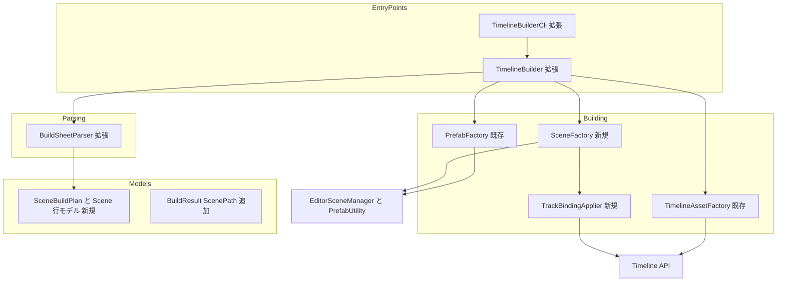
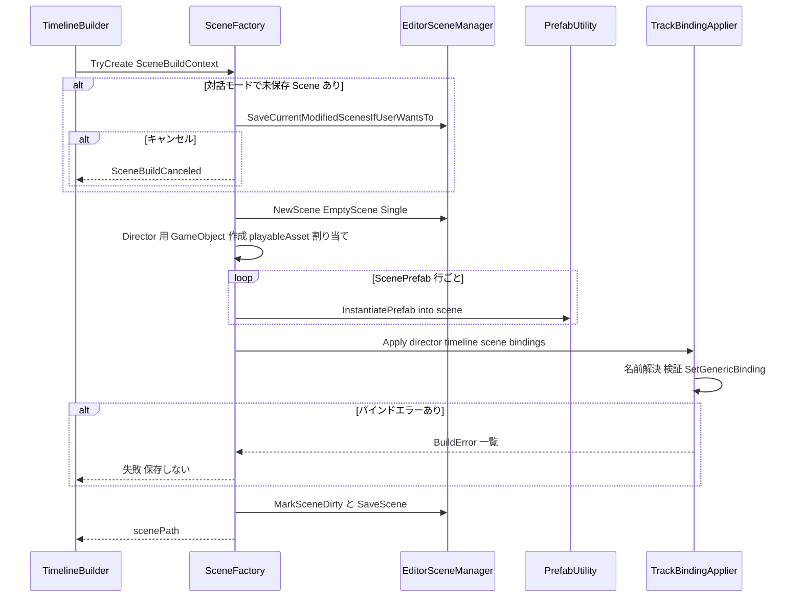

# Technical Design Document

## Overview

**Purpose**: 本機能は、UPM パッケージ「Unity Timeline Builder」を拡張し、構築情報 CSV/TSV から PlayableDirector へのバインド設定が完了した Scene ファイル(.unity)を自動生成する能力をコンテンツ制作者・ビルドパイプライン管理者へ提供する。

**Users**: コンテンツ制作者は Google スプレッドシート上のデータだけで「開けば再生できる Scene」までを指定し、ビルドパイプライン管理者は -batchmode / -executeMethod 経由で CI からバインド済み Scene を生成する。ツール開発者は既存の public static API 経由で同一処理を再利用する。

**Impact**: 既存の CSV → TimelineAsset / Prefab パイプライン(timeline-prefab-builder 仕様)への拡張。CSV フォーマットに行種別キー(`Scene` / `ScenePrefab` / `SceneBind`)を追加し、Building 層に Scene 生成コンポーネントを新設する。既存フォーマット入力時の成果物・挙動・公開 API シグネチャは維持する(1.5, 5.4)。

### Goals
- 既存パース規約(RFC 4180・ヘッダー判定・固定 7 列フォールバック・Google スプレッドシートエクスポート互換)を変更せずに Scene 構築情報を表現する
- Scene 生成 → PlayableDirector 配置 → TimelineAsset 割り当て → Prefab インスタンス配置 → AnimationTrack バインディング → 保存、を 1 回の Build で完結させる
- バインディングが Scene 再オープン後も保持される永続化手順を保証する
- 公開 API / CLI の呼び出し互換を維持しつつ、生成 Scene パスを結果として返却する

### Non-Goals
- AnimationTrack 以外のトラック(AudioTrack 等)のバインディング設定(将来拡張)
- プロジェクト外 Prefab のコピー・インポート(Prefab は `Assets/` 配下のアセットパス指定のみ)
- 既存 Scene への追記・マージ(新規生成のみ。既存 .unity は上書き)
- 階層パス(`Root/Child` 形式)によるバインド対象指定(名前完全一致のみ)
- ランタイムでの Scene 構築、JSON/XML 等の他フォーマット

## Boundary Commitments

### This Spec Owns
- Scene 構築行(`Scene` / `ScenePrefab` / `SceneBind`)の列仕様・パース・バリデーションの定義と実装
- Scene ファイル生成・PlayableDirector 配置・Prefab インスタンス配置・AnimationTrack バインディング設定・Scene 保存の契約と実装
- `BuildResult.ScenePath` / 追加 `BuildErrorCode` の契約
- CSV テンプレート・列定義ドキュメントの Scene 行仕様の追記

### Out of Boundary
- 既存のクリップ行パース規約・リソース解決・TimelineAsset / Prefab 構築の挙動(timeline-prefab-builder 仕様が所有。変更しない)
- 生成 Scene の Build Settings / Addressables への登録(利用者・CI 側の責務)
- Google スプレッドシート側の運用(シート構成、エクスポート手順)
- Unity Editor プロセスの起動・ライセンス管理(CI スクリプト側の責務)

### Allowed Dependencies
- `com.unity.timeline` 1.8.13(TimelineAsset / AnimationTrack / PlayableDirector)— 既存依存のまま、追加依存なし
- Unity Editor API: `UnityEditor.SceneManagement.EditorSceneManager` / `PrefabUtility.InstantiatePrefab` / `AssetDatabase`(新規使用)
- 既存レイヤー構造 `Models → Parsing → Resources → Building → Api → Cli` に従う。Scene 系新規コンポーネントは Building 層に属する
- 外部 NuGet / サードパーティライブラリへの依存は禁止

### Revalidation Triggers
- Scene 行の列仕様(行種別キー・列対応・必須性)の変更 → CSV テンプレート・列定義ドキュメント・パーサーの三者同期を再検証(7.3)
- `BuildResult` / `BuildErrorCode` の形状変更 → CLI 利用側(CI スクリプト)と API 利用者への影響確認
- 行種別予約キーの追加 → `TrackBuilderRegistry` の予約キーガードと衝突確認
- com.unity.timeline / Unity Editor のメジャー更新 → EditorSceneManager / SetGenericBinding の挙動再確認

## Architecture

### Existing Architecture Analysis
- **パイプライン + Strategy レジストリ**: `TimelineBuilder.Build` が Parse → Resolve(Phase A)→ Timeline/Prefab 生成(Phase B)を統括。エラーは `BuildError` として収集され、Phase A で 1 件以上あれば Phase B に進まない
- **依存方向(強制)**: `Models → Parsing → Resources → Building → Api → Cli`。左のレイヤーは右を import しない
- **維持すべき統合点**: `BuildSheetParser.Parse` の入出力、`BuildResult` の public 4 引数コンストラクタ、CLI 引数・exit code 体系(0/1/2)、上書き時の `Overwriting ...` ログ規約、`(trackType, trackName)` によるトラック一意集約
- Scene 関連コード(EditorSceneManager / SetGenericBinding / InstantiatePrefab)は既存に存在せず、全て新規となる

### Architecture Pattern & Boundary Map

採用パターン: **既存パイプラインへのフェーズ追加**(Phase A に Scene 検証、Phase B 末尾に Scene 生成)。評価の詳細は `research.md` 参照。



**Architecture Integration**:
- Selected pattern: 既存 2 フェーズコミットの拡張。Phase A で Scene 行の静的検証(Prefab 解決・Timeline 参照解決・Track 名事前検証)まで済ませ、Phase B の最終ステップとして Scene を生成・保存する
- Domain boundaries: Parsing は「行 → 型付き Scene 行モデル」まで、Building の SceneFactory は「Scene の生成・配置・保存」、TrackBindingApplier は「名前解決とバインディング適用」のみを所有する
- Existing patterns preserved: `BuildError` 収集、`TryXxx + out BuildError` パターン、`[UnityTimelineBuilder]` ログ接頭辞、上書きログ、GUID 保持の冪等上書き
- New components rationale: Scene 生成(EditorSceneManager 操作)と名前解決 + バインディング(探索アルゴリズム)は失敗モードが異なるため分離し、単体で検証可能にする
- Steering compliance: steering 未整備のため、timeline-prefab-builder 設計のレイヤー規約を基準として踏襲する

**Phase B の実行順序(ゲート条件)**: TimelineAsset 生成 → Prefab 生成 → **Scene 生成(Scene 行がある場合のみ)**。Scene 生成内は「NewScene → Director 配置 → Prefab インスタンス配置 → バインディング適用 → 保存」の順で、バインディングまで全て成功した場合のみ保存する(失敗時は既存 .unity を破壊しない)。

### Technology Stack

| Layer | Choice / Version | Role in Feature | Notes |
|-------|------------------|-----------------|-------|
| Scene 操作 | UnityEditor.SceneManagement.EditorSceneManager(Unity 6000.0) | 空 Scene 作成(EmptyScene/Single)・MarkSceneDirty・SaveScene | 新規使用。batchmode 互換(`research.md` 参照) |
| Prefab 配置 | UnityEditor.PrefabUtility.InstantiatePrefab | Prefab 接続を保持したインスタンス配置(3.1) | 新規使用 |
| バインディング | UnityEngine.Playables.PlayableDirector.SetGenericBinding | AnimationTrack → Animator の割り当て(4.1) | Scene 側にシリアライズされる |
| Timeline | com.unity.timeline 1.8.13 | AnimationTrack の列挙・照合 | 既存依存のまま。追加依存なし |
| テスト | com.unity.test-framework(EditMode) | Scene 生成・再オープン検証 | 既存導入済み |

## File Structure Plan

### Directory Structure(新規ファイル)
```
UnityTimelineBuilder/Packages/com.hidano.unity-timeline-builder/
├── Editor/
│   ├── Models/
│   │   └── SceneRows.cs              # SceneDefinitionRow / ScenePrefabRow / SceneBindRow / SceneBuildPlan(internal 不変モデル)
│   └── Building/
│       ├── SceneFactory.cs           # Scene 生成・Director 配置・Prefab 配置・保存の統括
│       └── TrackBindingApplier.cs    # GameObject 名前解決 + SetGenericBinding 適用
└── Tests/
    ├── Editor/
    │   ├── SceneRowParsingTests.cs           # Scene 行パース・検証の単体テスト
    │   ├── SceneFactoryTests.cs              # Scene 生成・上書き・失敗時未保存の統合テスト
    │   ├── TrackBindingApplierTests.cs       # 名前解決・重複・Animator 欠落の統合テスト
    │   └── SceneBuilderIntegrationTests.cs   # CSV → .unity の E2E(再オープン検証含む)
    └── Fixtures/
        └── (scene 行入り CSV、バインド対象付きテスト用 Prefab 等)
```

### Modified Files
- `Editor/Parsing/BuildSheetParser.cs` — 行種別キーの認識と Scene 行のパース・検証を追加。`ParseOutcome` に `ScenePlan` を追加
- `Editor/Api/TimelineBuilder.cs` — Phase A に Scene 行の静的検証(Prefab / Timeline 参照 / Track 名)、Phase B に SceneFactory 呼び出しを追加
- `Editor/Api/TimelineBuilderCli.cs` — 成功時に ScenePath をログ出力(引数仕様は無変更)
- `Editor/Models/BuildResult.cs` — `ScenePath` プロパティと 5 引数コンストラクタを追加(既存 4 引数コンストラクタは維持)
- `Editor/Models/BuildError.cs` — `BuildErrorCode` に Scene 系コードを末尾追加
- `Editor/Building/TrackBuilderRegistry.cs` — 予約行種別キー(`Scene` / `ScenePrefab` / `SceneBind`)の登録拒否ガードを追加
- `Documentation~/timeline-template.csv` — Scene 行のサンプルを追加(7.1)
- `Documentation~/column-definitions.md` — 行種別ごとの列対応表を追加(7.2, 7.3)
- `package.json` / `CHANGELOG.md` / `README.md` — バージョン(0.2.0)・変更履歴・使用例の更新

## System Flows

### Scene 構築シーケンス(Phase B 末尾)



- バインディングエラー(4.4–4.7)は最初の 1 件で打ち切らず全 `SceneBind` 行分を収集してから失敗を返す(1 回の実行で全不備を報告する既存方針の踏襲)
- 保存は全処理成功後の 1 回のみ。失敗時は SaveScene を呼ばないため、上書き対象の既存 .unity は無傷のまま残る
- 上書き時(既存 .unity が存在)は保存前に `Overwriting Scene: {path}` をログ出力(2.5)

## Requirements Traceability

| Requirement | Summary | Components | Interfaces | Flows |
|-------------|---------|------------|------------|-------|
| 1.1 | Scene 名・Timeline・Prefab・バインド対象名を指定できるフォーマット | BuildSheetParser, SceneRows | Scene 行列仕様 | Phase A |
| 1.2 | 同一ファイル内でクリップ行と区別 | BuildSheetParser | 行種別キー(trackType 列) | Phase A |
| 1.3 | Track 名によるバインド対応指定 | SceneRows(SceneBindRow), TrackBindingApplier | `SceneBindRow.TrackName` | Phase A/B |
| 1.4 | Google スプレッドシートエクスポート互換のパース | CsvSheetReader(既存・無変更), BuildSheetParser | 既存パース規約 | Phase A |
| 1.5 | 既存フォーマット入力時の従来どおりの動作 | BuildSheetParser, TimelineBuilder | `ScenePlan == null` 分岐 | 全体 |
| 1.6 | 必須欠落・解釈不能値の行番号付きエラーと中断 | BuildSheetParser | `BuildError(RowValidationError)` | Phase A |
| 2.1 | Scene ファイル生成と出力先保存 | SceneFactory | `SceneFactory.TryCreate` / SaveScene | Phase B |
| 2.2 | PlayableDirector 付き GameObject の配置 | SceneFactory | Director 配置規約 | Phase B |
| 2.3 | playableAsset への TimelineAsset 割り当て(同一ビルド生成含む) | TimelineBuilder, SceneFactory | Timeline 参照規約(空欄 = 同一ビルド) | Phase A/B |
| 2.4 | TimelineAsset 解決不能エラーと中断 | TimelineBuilder | `BuildError(SceneTimelineNotFound)` | Phase A |
| 2.5 | 既存 Scene の上書きとログ | SceneFactory | Overwriting ログ規約 | Phase B |
| 3.1 | Prefab インスタンスとしての配置 | SceneFactory | `PrefabUtility.InstantiatePrefab` | Phase B |
| 3.2 | 複数 Prefab 指定の受け付け | SceneRows, SceneFactory | `SceneBuildPlan.Prefabs`(行順) | Phase A/B |
| 3.3 | Assets/ 配下アセットパスとしての解決 | TimelineBuilder | Prefab 解決規約 | Phase A |
| 3.4 | Prefab 解決不能エラーと中断 | TimelineBuilder | `BuildError(ScenePrefabInvalid)` | Phase A |
| 4.1 | 名前一致 GameObject の Animator を AnimationTrack にバインド | TrackBindingApplier | `TrackBindingApplier.Apply` | Phase B |
| 4.2 | 再オープン後も保持される保存 | SceneFactory | MarkSceneDirty → SaveScene 手順 | Phase B |
| 4.3 | バインド指定のない Track は未設定のまま | TrackBindingApplier | SceneBind 行以外に SetGenericBinding を呼ばない | Phase B |
| 4.4 | GameObject 不在エラー | TrackBindingApplier | `BuildError(BindTargetNotFound)` | Phase B |
| 4.5 | 同名重複エラー | TrackBindingApplier | `BuildError(BindTargetDuplicated)` | Phase B |
| 4.6 | Animator 欠落エラー | TrackBindingApplier | `BuildError(BindTargetMissingAnimator)` | Phase B |
| 4.7 | Track 名不一致エラー | TimelineBuilder(Phase A 事前検証), TrackBindingApplier | `BuildError(BindTrackNotFound)` | Phase A/B |
| 5.1 | Scene 構築を含む public static メソッド | TimelineBuilder | `TimelineBuilder.Build`(既存シグネチャ) | 全体 |
| 5.2 | 成否・失敗理由・Scene パスの返却 | BuildResult | `BuildResult.ScenePath` | 全体 |
| 5.3 | 不正引数の通知 | TimelineBuilder | `ArgumentException` / `BuildError`(既存) | 入口 |
| 5.4 | 既存公開 API の呼び出し互換維持 | BuildResult, BuildRequest, TimelineBuilder | 4 引数コンストラクタ維持・enum 末尾追加 | — |
| 6.1 | -batchmode / -executeMethod エントリポイント | TimelineBuilderCli | `TimelineBuilderCli.Build`(既存) | CLI |
| 6.2 | コマンドライン引数の読み取り | TimelineBuilderCli | 既存引数仕様(無変更) | CLI |
| 6.3 | 成功時 Scene パスログ + exit code 0 | TimelineBuilderCli | ScenePath ログ追加 | CLI |
| 6.4 | 失敗時の原因ログ + 非 0 exit code | TimelineBuilderCli | 既存エラーログ規約(Scene 系コード含む) | CLI |
| 7.1 | テンプレートへの Scene 行サンプル追加 | Documentation~ | `timeline-template.csv` | — |
| 7.2 | 列定義ドキュメントへの Scene 行仕様追加 | Documentation~ | `column-definitions.md` | — |
| 7.3 | ドキュメントとパーサー仕様の一致 | BuildSheetParser, Documentation~ | 列仕様(単一情報源は本設計の Scene 行列仕様表) | — |

## Components and Interfaces

| Component | Domain/Layer | Intent | Req Coverage | Key Dependencies (P0/P1) | Contracts |
|-----------|--------------|--------|--------------|--------------------------|-----------|
| SceneRows(SceneBuildPlan ほか) | Models | Scene 構築情報の型付き不変モデル | 1.1, 1.3, 3.2 | — | State |
| BuildSheetParser(拡張) | Parsing | 行種別キーの認識と Scene 行のパース・検証・集約 | 1.1, 1.2, 1.5, 1.6 | SceneRows (P0) | Service |
| SceneFactory | Building | Scene 生成・Director 配置・Prefab 配置・保存の統括 | 2.1, 2.2, 2.5, 3.1, 3.2, 4.2 | TrackBindingApplier (P0), EditorSceneManager (P0), PrefabUtility (P0) | Service |
| TrackBindingApplier | Building | GameObject 名前解決と SetGenericBinding 適用 | 4.1, 4.3–4.7 | PlayableDirector / Timeline API (P0) | Service |
| TimelineBuilder(拡張) | Api | Scene 行の Phase A 静的検証と Phase B オーケストレーション | 2.3, 2.4, 3.3, 3.4, 4.7, 5.1–5.4 | SceneFactory (P0), AssetDatabase (P0) | Service |
| TimelineBuilderCli(拡張) | Cli | ScenePath のログ出力 | 6.1–6.4 | TimelineBuilder (P0) | Batch |
| BuildResult / BuildErrorCode(拡張) | Models | ScenePath の返却と Scene 系エラーコード | 5.2, 5.4 | — | State |
| Documentation~(拡張) | Package | テンプレート・列定義の Scene 行仕様追記 | 7.1–7.3 | — | — |

### Parsing

#### BuildSheetParser(拡張)

| Field | Detail |
|-------|--------|
| Intent | trackType 列の予約行種別キーで行をルーティングし、Scene 行を型付きモデルへ変換・検証して `SceneBuildPlan` に集約する |
| Requirements | 1.1, 1.2, 1.5, 1.6, 7.3 |

**Responsibilities & Constraints**
- 行ルーティング: データ行の trackType 列値が予約キー `Scene` / `ScenePrefab` / `SceneBind`(大文字小文字無視、trim 後比較)に一致する場合は Scene 行として解釈し、それ以外は既存のクリップ行パースへ委譲する。ヘッダー判定・列マッピング・固定 7 列フォールバックの既存ロジックは変更しない(1.4, 1.5)
- Scene 行の検証(すべて行番号付き `RowValidationError` として収集。1.6):
  - `Scene` 行が 2 行以上 → エラー(1 シート = 1 Scene。`research.md` 参照)
  - `ScenePrefab` / `SceneBind` 行があるのに `Scene` 行がない → エラー
  - 行種別ごとの必須列(下表)の欠落 → エラー
  - Scene 名にファイル名として不正な文字(パス区切り・OS 禁止文字)を含む → エラー
- `SceneBind` 行の Track 名重複(同一 Track 名への複数バインド指定)→ エラー(バインド先が一意に定まらないため)
- クリップ行が 1 行もなく Scene 行のみの入力も許容する(空の TimelineAsset + Scene が生成される)

**Scene 行の列仕様(単一情報源。テンプレート・列定義ドキュメントはこの表と一致させる: 7.3)**

| 行種別(trackType 列) | trackName 列 | clipName 列 | startTime / clipIn / duration 列 | resourcePath 列 |
|---|---|---|---|---|
| `Scene` | Scene 名(**必須**。ファイル名に使用) | 未使用(空欄) | 未使用(空欄) | 割り当てる TimelineAsset(**任意**。空欄 = 同一ビルドで生成した TimelineAsset、`Assets/` 始まり = 既存 TimelineAsset のパス) |
| `ScenePrefab` | 未使用(空欄) | 未使用(空欄) | 未使用(空欄) | 配置する Prefab のアセットパス(**必須**。`Assets/` 配下) |
| `SceneBind` | バインド先 AnimationTrack の Track 名(**必須**。クリップ行の trackName と一致させる) | 未使用(空欄) | 未使用(空欄) | バインド対象の GameObject 名(**必須**。Scene 内で一意であること) |

- 未使用列は空欄のまま残す(ヘッダーレス固定 7 列順でも位置が保たれる)。未使用列に値が入っていても無視する(警告なし)
- 数値列(startTime 等)の必須検証はクリップ行にのみ適用し、Scene 行には適用しない

**Dependencies**
- Inbound: TimelineBuilder — パイプライン呼び出し(P0)
- Outbound: SceneRows モデル(P0)。Building 層への依存は引き続き禁止(予約キーはパーサー内の定数として保持)

**Contracts**: Service [x]

##### Service Interface
```csharp
internal sealed class BuildSheetParser
{
    // 既存コンストラクタ・Parse シグネチャは無変更
    public ParseOutcome Parse(IReadOnlyList<IReadOnlyList<string>> rawRows);
}

internal sealed class ParseOutcome
{
    public IReadOnlyList<ClipRow> Rows { get; }          // 既存(クリップ行のみ)
    public IReadOnlyList<BuildError> Errors { get; }     // 既存
    public string WarningMessage { get; }                // 既存
    public SceneBuildPlan ScenePlan { get; }             // 追加: Scene 行なしのとき null
}
```
- Preconditions: `rawRows` は CsvSheetReader の出力
- Postconditions: `Errors` が空のとき、`ScenePlan` は非 null なら完全(Scene 定義 + 全 Prefab 行 + 全バインド行)。Scene 行なしの入力では `ScenePlan == null` かつ既存出力と完全一致(1.5)
- Invariants: Scene 行は `Rows`(クリップ行)に混入しない。行の出現順を保持する

### Models

#### SceneRows(SceneDefinitionRow / ScenePrefabRow / SceneBindRow / SceneBuildPlan)

| Field | Detail |
|-------|--------|
| Intent | Scene 構築情報の型付き不変モデル(パース結果の集約) |
| Requirements | 1.1, 1.3, 3.2 |

**Contracts**: State [x]

##### State Management
```csharp
/// <summary>Scene 定義行(1 シートに高々 1 行)。</summary>
internal sealed class SceneDefinitionRow
{
    public int LineNumber { get; }
    public string SceneName { get; }              // 必須。.unity ファイル名
    public string TimelineAssetPath { get; }      // null = 同一ビルド生成の TimelineAsset を割り当て
}

/// <summary>Prefab 配置行。</summary>
internal sealed class ScenePrefabRow
{
    public int LineNumber { get; }
    public string PrefabAssetPath { get; }        // Assets/ 配下
}

/// <summary>バインド指定行。</summary>
internal sealed class SceneBindRow
{
    public int LineNumber { get; }
    public string TrackName { get; }              // AnimationTrack 名(Ordinal 完全一致)
    public string GameObjectName { get; }         // バインド対象 GameObject 名(Ordinal 完全一致)
}

/// <summary>パース済み Scene 構築計画(不変)。</summary>
internal sealed class SceneBuildPlan
{
    public SceneDefinitionRow Definition { get; }
    public IReadOnlyList<ScenePrefabRow> Prefabs { get; }   // 行出現順
    public IReadOnlyList<SceneBindRow> Bindings { get; }    // 行出現順
}
```
- State model: パース後は不変。Phase A の解決結果は別型(`ResolvedScenePlan`)で保持し、本モデルを変更しない
- Persistence & consistency: 永続化しない(構築ジョブ内の中間表現)

### Building

#### SceneFactory

| Field | Detail |
|-------|--------|
| Intent | 空 Scene の作成、PlayableDirector 配置、Prefab インスタンス配置、バインディング適用の統括、および Scene の保存 |
| Requirements | 2.1, 2.2, 2.5, 3.1, 3.2, 4.2 |

**Responsibilities & Constraints**
- 対話モード(`Application.isBatchMode == false`)では処理前に `EditorSceneManager.SaveCurrentModifiedScenesIfUserWantsTo()` を呼ぶ。キャンセル時は `SceneBuildCanceled` で中断(利用者の未保存 Scene を黙って破棄しない)。batchmode では確認なしで続行
- `EditorSceneManager.NewScene(NewSceneSetup.EmptyScene, NewSceneMode.Single)` で空 Scene を作成(`research.md` の Decision 参照。Additive は batchmode の Untitled Scene と競合するため不採用)
- Director 配置: Scene 直下に新規 GameObject(名前 = TimelineAsset のアセット名)を作成し `PlayableDirector` を追加、`playableAsset` に TimelineAsset を割り当てる(2.2)。生成済み Prefab のインスタンスは使用しない(バインディングを Prefab オーバーライドにしないため。`research.md` 参照)。`playOnAwake` は既定値のまま
- Prefab 配置: `ScenePrefab` 行の出現順に `PrefabUtility.InstantiatePrefab(prefabAsset, scene)` で配置(3.1, 3.2)。位置・回転はプレハブの既定値のまま(Transform を変更しない)。インスタンス名は Unity 既定(プレハブ名)のまま
- バインディング適用は TrackBindingApplier へ委譲。エラーが 1 件以上返された場合は **SaveScene を呼ばずに** 失敗を返す(既存 .unity を破壊しない)
- 保存: `EditorSceneManager.MarkSceneDirty(scene)` → `EditorSceneManager.SaveScene(scene, scenePath)` の順で 1 回のみ実行(4.2)。保存失敗は `SceneWriteFailed`。出力パス `{outputDirectory}/{sceneName}.unity` に既存ファイルがある場合は保存前に `[UnityTimelineBuilder] Overwriting Scene: {path}` をログ出力(2.5)。上書きは `.meta` / GUID を維持する

**Dependencies**
- Inbound: TimelineBuilder — Phase B 末尾で呼び出し(P0)
- Outbound: TrackBindingApplier — バインディング適用(P0)
- External: EditorSceneManager / PrefabUtility / PlayableDirector(P0)

**Contracts**: Service [x]

##### Service Interface
```csharp
/// <summary>Phase A の成果物: 検証・解決済みの Scene 構築入力。</summary>
internal sealed class SceneBuildContext
{
    public SceneBuildPlan Plan { get; }
    public TimelineAsset Timeline { get; }                       // 割り当て対象(同一ビルド生成 or 既存)
    public IReadOnlyList<GameObject> PrefabAssets { get; }       // Plan.Prefabs と同順の解決済み Prefab アセット
    public string ScenePath { get; }                             // {outputDirectory}/{sceneName}.unity
    public string DirectorObjectName { get; }                    // TimelineAsset のアセット名
}

internal sealed class SceneFactory
{
    /// <summary>Scene を構築・保存する。失敗時は errors に 1 件以上を格納し false を返す(Scene は保存されない)。</summary>
    public bool TryCreate(SceneBuildContext context,
                          out string scenePath, out IReadOnlyList<BuildError> errors);
}
```
- Preconditions: `context` の全参照は Phase A で解決済み(null なし)。Unity Editor メインスレッドから呼び出す
- Postconditions: true のとき `scenePath` の .unity が存在し、PlayableDirector・Prefab インスタンス・バインディングが保存済み。false のとき `errors.Count >= 1` かつ `scenePath` のファイルは実行前の状態のまま
- Invariants: SaveScene は高々 1 回。`SceneBind` 行に対応しないトラックへ `SetGenericBinding` を呼ばない(4.3)

#### TrackBindingApplier

| Field | Detail |
|-------|--------|
| Intent | Scene 内の GameObject 名前解決と AnimationTrack への Animator バインディング適用 |
| Requirements | 4.1, 4.3, 4.4, 4.5, 4.6, 4.7 |

**Responsibilities & Constraints**
- 探索範囲: Scene の全ルート GameObject 配下の全階層(Prefab インスタンス内部を含む)。**非アクティブ GameObject も含む**(`GetComponentsInChildren<Transform>(true)` 相当)。ただし本ツールが生成した Director 用 GameObject(そのルートのみ)は探索対象から除外する(名前を利用者が制御できないため。`research.md` の Decision 参照)
- 一致規則: GameObject 名の完全一致(`StringComparison.Ordinal`、大文字小文字区別)。階層パス指定は非対応
- 検証と適用(全 `SceneBind` 行を処理してエラーを収集。最初の失敗で打ち切らない):
  1. Track 解決: `timeline.GetOutputTracks()` から `AnimationTrack` かつ Track 名 Ordinal 完全一致のものを取得。不在(名前不一致・AnimationTrack 以外しかない)→ `BindTrackNotFound`(4.7)
  2. GameObject 解決: 名前一致 0 件 → `BindTargetNotFound`(4.4)。2 件以上 → `BindTargetDuplicated`(重複した名前と件数をメッセージに含む)(4.5)
  3. Animator 取得: 一致 GameObject 自身に `Animator` がない → `BindTargetMissingAnimator`(4.6)。子の Animator は探索しない(バインド対象は名前で特定した GameObject 自身)
  4. `director.SetGenericBinding(track, animator)` を適用(4.1)
- `SceneBind` 行のないトラックには一切触れない(4.3)。エラーは行番号・対象名(Track 名 / GameObject 名)を含める

**Dependencies**
- Inbound: SceneFactory(P0)
- External: PlayableDirector.SetGenericBinding / UnityEngine.Timeline(P0)

**Contracts**: Service [x]

##### Service Interface
```csharp
internal sealed class TrackBindingApplier
{
    /// <summary>全バインド指定を検証・適用し、発生した全エラーを返す(空 = 成功)。</summary>
    public IReadOnlyList<BuildError> Apply(PlayableDirector director,
                                           TimelineAsset timeline,
                                           Scene scene,
                                           GameObject directorObject,
                                           IReadOnlyList<SceneBindRow> bindings);
}
```
- Preconditions: `director` は `scene` 内に配置済み、`timeline` は `director.playableAsset`
- Postconditions: 返却リストが空のとき、全 `bindings` に対応するバインディングが director に設定済み。非空のとき、部分適用されたバインディングがあっても呼び出し元(SceneFactory)は保存しないため永続化されない
- Invariants: `bindings` に列挙されないトラックのバインディング状態を変更しない(4.3)

### Api

#### TimelineBuilder(拡張)

| Field | Detail |
|-------|--------|
| Intent | Scene 行の Phase A 静的検証と、Phase B での SceneFactory 呼び出し・結果集約 |
| Requirements | 2.3, 2.4, 3.3, 3.4, 4.7, 5.1, 5.2, 5.3, 5.4 |

**Responsibilities & Constraints**
- 公開シグネチャ(`Build(BuildRequest)` / `Build(string, string, string)`)・引数検証・`BuildRequest` は無変更(5.1, 5.3, 5.4)。`ScenePlan == null`(既存フォーマット入力)のとき、処理経路・成果物・ログは従来と完全に同一で `BuildResult.ScenePath` は null(1.5)
- **Phase A 追加検証**(`ScenePlan != null` のとき。エラーは既存どおり収集・一括報告):
  - Timeline 参照(2.3, 2.4): `Scene` 行の resourcePath が空欄 → 同一ビルド生成の TimelineAsset を割り当て対象とする(暗黙参照)。`Assets/` 始まり → `AssetDatabase.LoadAssetAtPath<TimelineAsset>` で解決し、不在・型不一致は `SceneTimelineNotFound`。それ以外の値 → `SceneTimelineNotFound`
  - Prefab 解決(3.3, 3.4): 各 `ScenePrefab` 行の resourcePath を `Assets/` 配下パスとして `AssetDatabase.LoadAssetAtPath<GameObject>` で解決。`Assets/` 始まりでない・不在・GameObject アセットでない場合は `ScenePrefabInvalid`(行番号・参照パス付き)
  - Track 名事前検証(4.7): 割り当て Timeline が同一ビルド生成の場合、クリップ行のうち trackType が `Animation` の trackName 集合と `SceneBind.TrackName` を Ordinal 照合。既存 Timeline の場合は `GetOutputTracks()` の AnimationTrack 名と照合。不一致は `BindTrackNotFound`。これにより Track 名の綴りミスを Scene 生成前(Phase A)で検出する
  - Scene 出力パス衝突: `{outputDirectory}/{sceneName}.unity` が TimelineAsset / Prefab の出力パスと衝突しないことを確認(Scene 名 = アセット名は拡張子が異なるため許容)
- **Phase B 追加**: TimelineAsset・Prefab 生成後、`SceneBuildContext` を組み立てて `SceneFactory.TryCreate` を呼ぶ。失敗時は返却されたエラーで `BuildResult` 失敗を返す(このとき TimelineAsset / Prefab は生成済みのまま残る — ログにその旨を明示する)
- 成功時: `BuildResult(true, timelinePath, prefabPath, scenePath, empty)` を返し、`[UnityTimelineBuilder] Scene: {scenePath}` をログ出力

**Dependencies**
- Inbound: TimelineBuilderCli / エディタ拡張・外部ツール(P0)
- Outbound: BuildSheetParser / SceneFactory / 既存 Building 層(P0)
- External: AssetDatabase(P0)

**Contracts**: Service [x]

##### Service Interface(公開契約の差分)
```csharp
namespace Hidano.UnityTimelineBuilder.Editor
{
    // TimelineBuilder / BuildRequest: シグネチャ変更なし(5.4)

    /// <summary>構築結果。Scene 構築を含む場合は ScenePath が設定される。</summary>
    public sealed class BuildResult
    {
        public bool Success { get; }
        public string TimelineAssetPath { get; }
        public string PrefabPath { get; }
        public string ScenePath { get; }              // 追加: 成功かつ Scene 構築時のみ非 null
        public IReadOnlyList<BuildError> Errors { get; }

        // 既存コンストラクタ(維持): ScenePath = null で委譲
        public BuildResult(bool success, string timelineAssetPath, string prefabPath,
                           IReadOnlyList<BuildError> errors);

        // 追加コンストラクタ
        public BuildResult(bool success, string timelineAssetPath, string prefabPath,
                           string scenePath, IReadOnlyList<BuildError> errors);
    }

    public enum BuildErrorCode
    {
        // 既存 10 値は順序・値を維持し、末尾に追加(ソース互換)
        ArgumentInvalid, SheetNotFound, SheetParseError, RowValidationError,
        UnknownTrackType, ResourceNotFound, ResourceTypeMismatch, ImportFailed,
        OutputWriteFailed, Unexpected,
        SceneTimelineNotFound,       // 2.4: Timeline 参照の解決不能
        ScenePrefabInvalid,          // 3.4: Prefab パスの解決不能・型不一致
        BindTrackNotFound,           // 4.7: Track 名に一致する AnimationTrack なし
        BindTargetNotFound,          // 4.4: 名前一致 GameObject なし
        BindTargetDuplicated,        // 4.5: 名前一致 GameObject が複数
        BindTargetMissingAnimator,   // 4.6: Animator コンポーネント欠落
        SceneWriteFailed,            // 2.1: Scene 保存失敗
        SceneBuildCanceled,          // 対話モードでの保存確認キャンセル
    }
}
```
- Postconditions: `Success == true` かつ入力に Scene 行あり → `ScenePath` の .unity が存在する。Scene 行なし → `ScenePath == null` で既存挙動と同一
- Invariants: 同一入力での再実行は TimelineAsset / Prefab / Scene の全てを GUID 維持で上書きする(冪等)

### Cli

#### TimelineBuilderCli(拡張)

| Field | Detail |
|-------|--------|
| Intent | 成功時の ScenePath ログ出力(引数仕様・exit code 体系は無変更) |
| Requirements | 6.1, 6.2, 6.3, 6.4 |

**Responsibilities & Constraints**
- 引数(`-sheetPath` / `-outputDir` / `-assetName` / `-importDir`)・exit code(0/1/2)・エラーログフォーマットは既存のまま(6.1, 6.2, 6.4)。Scene 構築の有無は CSV の内容で決まるため、新規オプションは追加しない
- 成功時、`result.ScenePath` が非 null なら `[UnityTimelineBuilder] Scene: {path}` を既存の TimelineAsset / Prefab パスログに続けて出力(6.3)
- 失敗時は追加された Scene 系 `BuildErrorCode` も既存フォーマット(`Code (行 N) [path]: message`)でそのまま出力される(6.4。コード追加のみでロジック変更なし)

**Contracts**: Batch [x]

##### Batch / Job Contract
- Trigger / Input: 既存契約のまま(timeline-prefab-builder 設計参照)
- Output: 成功時ログに `Scene: {outputDir}/{sceneName}.unity` が追加される(Scene 行がある場合のみ)
- Idempotency & recovery: 再実行は .unity を GUID 維持で上書き。Scene 構築失敗時(exit 1)、TimelineAsset / Prefab は生成済みの場合がある(ログで判別可能)

### Package(Documentation~ 拡張)

| Field | Detail |
|-------|--------|
| Intent | テンプレート・列定義ドキュメントへの Scene 行仕様の追記 |
| Requirements | 7.1, 7.2, 7.3 |

**Implementation Notes**
- Integration:
  - `timeline-template.csv`: 既存ヘッダー・クリップ行サンプルの後に `Scene` / `ScenePrefab` / `SceneBind` 各 1 行以上のサンプルを追加(7.1)。例:
    ```csv
    trackType,trackName,clipName,startTime,clipIn,duration,resourcePath
    Audio,BGM,intro,0,0,3.2,Assets/Audio/intro.wav
    Animation,Character,intro,0.5,0,2.5,Assets/Animations/character.fbx
    Scene,SampleScene,,,,,
    ScenePrefab,,,,,,Assets/Prefabs/Character.prefab
    SceneBind,Character,,,,,CharacterRoot
    ```
  - `column-definitions.md`: 「Scene 行の列仕様」表(本設計 Parsing 節の表と同内容)、Timeline 参照規約(空欄 = 同一ビルド)、GameObject 名探索規約(非アクティブ含む・Ordinal 完全一致・重複エラー)を追記(7.2)
- Validation: 同梱テンプレートをそのまま入力にする E2E テストで、パーサー仕様との一致を自動担保(7.3)。テンプレートの Prefab 参照はテストフィクスチャ側で用意する(テンプレート内パスをフィクスチャで解決できる形にするか、E2E 用に Prefab を生成してから実行する)
- Risks: 三者不一致 → E2E テスト + Revalidation Trigger で防止

## Data Models

### Domain Model
- 集約は既存の「構築ジョブ」1 つのまま。`SceneBuildPlan`(パース済み)→ `SceneBuildContext`(解決済み)→ .unity ファイル、と一方向変換される不変データの列
- **Business rules & invariants**:
  - 1 シート = 1 Scene(`Scene` 行は高々 1 行)。`ScenePrefab` / `SceneBind` は `Scene` 行の存在が前提
  - Timeline 参照: resourcePath 空欄 = 同一ビルド生成 TimelineAsset(暗黙)、`Assets/` 始まり = 既存アセット(明示)
  - バインド一意性: 同一 Track 名への `SceneBind` は 1 行のみ。バインド対象 GameObject 名は Scene 全体(Director 用 GameObject を除く)で一意
  - Scene 行なし ⇒ 生成物・挙動は既存仕様と完全一致(後方互換不変条件)

### Data Contracts & Integration
- 入力 CSV/TSV の Scene 行契約は「Parsing > Scene 行の列仕様」の表が単一情報源(7.3)
- 公開 API の契約差分(`BuildResult.ScenePath` / `BuildErrorCode` 追加)は Api 節の Service Interface を正とする
- 物理データモデルは Unity アセットファイル(.unity 追加)のみ

## Error Handling

### Error Strategy
- 既存方針を踏襲: **Phase A は収集して一括報告**(Scene 行の検証・Prefab / Timeline 解決・Track 名事前検証を含む)、**Phase B は失敗時点で中断**。ただし TrackBindingApplier 内のバインドエラーは全 `SceneBind` 行分を収集してから失敗を返す(1 回の実行で全バインド不備を報告)
- **Scene のアトミック保存**: Phase B の Scene 生成はメモリ上で完結させ、保存(SaveScene)は全成功時の 1 回のみ。失敗時に既存 .unity・部分生成の .unity を残さない
- Scene 構築失敗時、TimelineAsset / Prefab は生成済みのまま残る(既存の Phase B セマンティクスと同じ)。ログで「Timeline / Prefab は生成済み、Scene は未生成」を明示する

### Error Categories and Responses
- **入力エラー(利用者起因)**: `RowValidationError`(Scene 行の必須欠落・重複・不正 Scene 名)/ `SceneTimelineNotFound` / `ScenePrefabInvalid` / `BindTrackNotFound` / `BindTargetNotFound` / `BindTargetDuplicated` / `BindTargetMissingAnimator` → 行番号・対象名(パス / Track 名 / GameObject 名)を含むメッセージで修正箇所を特定可能にする(1.6, 2.4, 3.4, 4.4–4.7)
- **環境エラー(システム起因)**: `SceneWriteFailed`(SaveScene 失敗)→ 対象パスと Unity 側エラー内容を報告
- **操作キャンセル**: `SceneBuildCanceled`(対話モードでの保存確認キャンセル)→ 何も変更せず中断
- **CLI 写像**: 変更なし(Scene 系エラーはすべて exit 1)

### Monitoring
- 既存の `[UnityTimelineBuilder]` 接頭辞ログ規約を踏襲。成功時は Scene パスを Info ログ(6.3)、上書き時は `Overwriting Scene:` ログ(2.5)、失敗時は全 `BuildError` を 1 行 1 件で Error ログ(6.4)

## Testing Strategy

### Unit Tests(EditMode)
1. `BuildSheetParser` Scene 行ルーティング: ヘッダーあり / ヘッダーレス固定 7 列の両モードで `Scene` / `ScenePrefab` / `SceneBind` 行が正しく `SceneBuildPlan` に集約され、クリップ行に混入しないこと(1.1, 1.2, 1.4)
2. `BuildSheetParser` 検証系: Scene 行 2 行・Scene 行なしの ScenePrefab/SceneBind・必須列欠落・不正 Scene 名・同一 Track 名への重複バインドが行番号付き `RowValidationError` になること(1.6)
3. 後方互換: Scene 行なしの既存 CSV で `ScenePlan == null` かつ既存パース結果と完全一致すること(1.5)
4. `BuildResult`: 4 引数コンストラクタが `ScenePath == null` で動作し既存互換であること。5 引数版の値保持(5.2, 5.4)
5. `TrackBuilderRegistry`: 予約キー(`Scene` 等)の `Register` 拒否

### Integration Tests(EditMode / 実 AssetDatabase・EditorSceneManager 使用)
1. Scene 行入り CSV → .unity 生成: Director GameObject の存在・`playableAsset` が生成 TimelineAsset を参照・Prefab インスタンスが `PrefabUtility.IsPartOfPrefabInstance` で真・バインド指定 Track の `GetGenericBinding` が対象 Animator を返すこと(2.1–2.3, 3.1, 3.2, 4.1)
2. **永続化検証**: 保存後に `EditorSceneManager.OpenScene` で再オープンし、`GetGenericBinding` が保持されていること(4.2)。バインド指定のない Track が未設定のままであること(4.3)
3. バインドエラー系: GameObject 不在・同名重複(非アクティブ含む)・Animator 欠落・Track 名不一致で各エラーコードが返り、**.unity が保存されない**こと(4.4–4.7)。複数不備が 1 回の実行で全件報告されること
4. Phase A エラー系: Prefab パス不在 / `Assets/` 外・既存 Timeline パス不在で `ScenePrefabInvalid` / `SceneTimelineNotFound` が返り、Scene どころか Timeline 生成にも進まないこと(2.4, 3.4)
5. 上書き再実行: 同一出力先へ 2 回実行し、`Overwriting Scene:` ログと .unity の GUID 維持を検証(2.5)
6. E2E: 更新後の同梱テンプレート `timeline-template.csv`(+ フィクスチャ Prefab)をそのまま入力とし、Scene 構築込みで成功すること(7.1–7.3)。既存フォーマットのみの CSV で従来成果物が生成され `ScenePath == null` であること(1.5)

### CLI / Batch(手動またはスクリプト検証)
1. `-batchmode -executeMethod` で Scene 行入り CSV を実行し、Scene パスログと exit code 0、失敗系で exit code 1 を確認(6.1–6.4)

## Security Considerations
- 既存方針から変更なし。書き込み先は引数検証で `Assets/` 配下(`outputDirectory`)に強制され、Scene ファイルも同ディレクトリ配下にのみ生成される
- 対話モードでは利用者の未保存 Scene を黙って破棄せず、保存確認(キャンセル時は中断)を挟む
